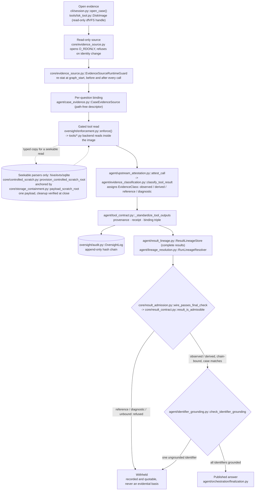

# Forensic Agent Architecture

The system separates three concerns: model driven investigation planning,
deterministic evidence processing, and execution control. The language model may
select the next analytical action, but it cannot open an evidence image or execute
an arbitrary command. It can access an approved case only through registered
Python functions whose calls are validated before execution.

Module and function names in this document refer to the source tree under
`src/forensic_agent`. Line numbers, where given, are navigation aids into that
tree and may drift as the code evolves; the module and function names are the
stable references.

## System boundaries

| Component | Responsibility |
|---|---|
| **Investigator** | Selects a case, asks questions, reviews findings, and retains responsibility for the final professional conclusion. |
| **Agent orchestration** | Maintains investigation state and coordinates model requests, function calls, recovery steps, verification, and cleanup. |
| **Language model** | Interprets the question, proposes registered function calls, and drafts an answer from returned findings. |
| **Oversight layer** | Validates function identity, arguments, capabilities, paths, and execution budgets before a call may run. |
| **Forensic function layer** | Exposes bounded, model callable functions backed by deterministic analyzers and established forensic tools. |
| **Evidence sources** | Disk images, memory captures, network captures, and approved derived artifacts opened without modifying the source. |
| **Standardized findings** | Normalize tool status, provenance, coverage, warnings, pagination, and content integrity metadata. |
| **Verification and reporting** | Relate answer claims to collected findings and present the result to the investigator. |
| **Run record** | Records questions, proposed calls, oversight decisions, findings, and the final outcome in `audit.jsonl` in chronological order, hash-chained so later modification is detectable. |

## Investigation lifecycle

1. The investigator opens an evidence source or case directory and asks one
   investigation question.
2. The system selects only the functions applicable to the loaded evidence types.
   The model receives their names, descriptions, and structured argument schemas.
3. The model proposes a function call or an answer draft. It does not execute the
   function itself.
4. The oversight layer checks the call against the active policy, allowed paths,
   required capabilities, and remaining execution budget.
5. An approved wrapper invokes the corresponding forensic implementation. A
   rejected or malformed call is not executed and is recorded as a structured
   error.
6. The raw result is converted to the common finding contract and returned to the
   investigation context. The model may request another function or draft an
   answer from the collected findings.
7. Deterministic recovery may complete an unambiguous missing step, continue a
   bounded result, or gather evidence required by a known safety condition.
8. Finalization checks provenance and coverage, constructs a bounded verification
   view, performs the configured answer verification, and records the final report.
9. Temporary resources are closed and the run record and the finding traces
   remain available for review.

The model therefore has functional access to the approved case, not unrestricted
access to the host file system. It has no general shell and cannot select arbitrary
host paths. The investigator defines the case boundary when evidence is opened or
attached.

## Orchestration

`src/forensic_agent/agent/runtime.py` is the stable public facade.
`run_investigation()` is the canonical programmatic entry point.

The implementation of one investigation is organized under
`src/forensic_agent/agent/orchestration/`:

| Module | Responsibility |
|---|---|
| `runner.py` | Defines investigation dependencies and the internal `_execute_investigation()` implementation. |
| `state.py` | Defines immutable configuration, prepared resources, and mutable investigation state. |
| `preparation.py` | Builds the model client, visible function set, budgets, evidence guards, traces, and controlled scratch resources. |
| `coordinator.py` | Owns the transaction boundary and orders analysis, recovery, finalization, and cleanup. |
| `investigation.py` | Runs the model driven analysis phase and collects messages and function results. |
| `recovery.py` | Applies bounded deterministic continuations when the initial phase leaves a recoverable gap. |
| `finalization.py` | Builds and verifies the report, applies publication checks, records telemetry, and closes resources. |

The orchestrator does not parse forensic evidence. Its role is to preserve state
and enforce the sequence in which the model, registered functions, verification,
and cleanup are invoked. Concrete deterministic continuations are isolated under
`src/forensic_agent/agent/recovery/`; the orchestration phase activates them only
when their explicit preconditions are satisfied. `agent/deterministic_recovery.py`
is the single surface that composes all bounded recovery families consumed by
orchestration, evidence and coverage rules included.

Exported reports distinguish the **runtime engine** from the **operation mode**.
The interactive implementation records the agent runtime as the runtime engine and
supervised as the operation mode. The operation-mode field is optional in the
reporting API so reports produced through older callers remain compatible.

## Forensic functions and analyzers

The model does not issue raw Volatility, dfVFS, RegRipper, or tshark
commands. It calls stable Python functions with explicit schemas. The
`agent/tool_bindings/` package builds these model facing wrappers, while the `tools/`
package contains the deterministic implementations and adapters to forensic
libraries and external programs.

The function layer combines:

- established libraries and tools, including dfVFS and TSK, libewf, regipy and
  libregf, RegRipper, Volatility 3, and tshark;
- bounded domain functions that combine several low level operations into one
  reviewable query;
- documented deterministic logic where an external tool does not provide the
  required stable contract.

The design principle is that forensic *reading* is delegated to established
backends, and the harness adds only bounded, documented interpretation on top of
them. Each result names the component and the version that produced it. Where the
harness does decide something itself, that logic is generic: it carries no case
identifier and no expected answer, and it publishes on the result what it decided
and which reader supplied each underlying value, so the reasoning is re-derivable
from the record rather than taken on trust.

### Where the harness adds interpretation

A small amount of forensic logic is implemented in-house, and it is enumerated
here. Two distinctions matter when reading it.

First, delegation is preferred wherever a tool can carry the decision. Domain-name
boundaries are read from the Public Suffix List through **libpsl**
(`tools/public_suffix.py`); payload type is decided by **libmagic**; registry
value bytes are read through libregf's typed accessors, with the reader named on
each row. Nothing about a name, a type, or a value is decided by a table in this
project where an installed reader can decide it, and a host with no reader
installed reports nothing for that field rather than reviving a guess.

Second, the remaining in-house logic divides into two kinds, and the distinction
governs how it can be checked:

- Logic that decides **what a result says** is checkable: a reader holds the
  artifact and the rule and can re-derive the reading. Examples are the FAT
  local-time reversal in `tools/tsk_tool.py`, which inverts a backend encoding
  step and publishes the recovered wall clock in its own `derived_local_wall_clock`
  block marked `is_upstream_observation: false`, never overwriting the source
  timestamps; and the leading-byte ZIP signal in
  `tools/payload_identification.py`, reported only beside libmagic's own answer and
  never merged into it.
- Logic that decides **what a call reaches** governs negative findings, and so is
  published as a structured refusal rather than an empty result. The
  journal-companion rule in `tools/sqlite_tool.py` refuses to open an in-image
  database when a WAL, shared-memory, rollback, super- or statement-journal
  companion sits beside it, or when the parent listing cannot prove those
  companions absent, and carries its own `journal_coverage` record so the refusal
  is never a silent negative. The cross-capture host selection in
  `tools/pcap_tool.py` decides only which of tshark's own endpoints is named
  `linked_machine`, publishing the rule as `selection_rule` and naming nobody on a
  tie.

The common property is that each in-house decision states, on the result, what it
decided and on what basis, so a reader can re-derive it rather than accept it.

## Evidence integrity and controlled scratch space

Original evidence is opened read only. Most analyzers work directly through that
interface. Registry, EVTX, and SQLite parsers may require a seekable local file;
for those calls the system creates a typed temporary copy inside a controlled
scratch directory. The model neither selects nor sees the host path.

Each call receives an isolated working area. Session cleanup verifies that
temporary copies and their directories have been removed. This protects the
source evidence and constrains application behavior, but it is not a substitute
for operating system access controls, secure deletion, or laboratory isolation.

`core/evidence_source.py` manages source identity and lifecycle.
`agent/evidence_custody.py` verifies that a previously opened source has not
changed during execution.

### The evidence lifecycle, end to end

A single reading travels from an opened source to either a published sentence or
a withheld one, and the class it was given decides which. The source is opened
read-only by `cli/session.py::open_case()` — a disk image becomes a read-only
dfVFS handle in `tools/tsk_tool.py::DiskImage` — and
`core/evidence_source.py::EvidenceSourceRuntimeGuard` re-stats it before and
after every call. A seekable parser (registry, EVTX, SQLite) reads a typed copy
in `core/controlled_scratch.py`, never the source. The class is assigned once, in
`agent/evidence_classification.py::classify_tool_result` behind
`agent/upstream_attestation.py::attest_call`, standardized into a receipt by
`agent/tool_contract.py`, bound to the append-only chain by
`oversight/audit.py::OversightLog`, retained by
`agent/result_lineage.py::ResultLineageStore`, and finally judged by
`core/result_admission.py::wire_passes_final_check` and
`agent/identifier_grounding.py::check_identifier_grounding`. A `reference` or
`diagnostic` reading is refused as an evidential basis at admission; it is still
recorded and quotable.

## Oversight and execution budgets

Every model proposed call passes through the oversight layer before the underlying
function can run. The active policy checks:

- whether the function is registered and visible in the current task;
- whether arguments conform to the function schema and allowed values;
- whether the session has the required capability;
- whether host paths remain within approved roots;
- whether model request, function call, output size, and time limits remain;
- whether the call and its outcome are recorded in the run record.

No general `shell` function, arbitrary process launcher, or unrestricted file
reader is exposed to the model. External programs are invoked only inside approved
function implementations.

## Standardized findings and provenance

Raw outputs from different forensic tools vary substantially. The internal
`forensic.tool-result.v2` contract, defined in `core/result_contract.py`, provides
a common representation containing:

- success status or structured error information;
- function and implementation identity;
- opaque evidence identity and an artifact locator;
- structured rows or bounded content;
- search coverage and completion state;
- warnings, truncation, and continuation metadata;
- a digest of the canonical finding content.

The superseded `forensic.tool-result.v1` remains in `core/tool_result.py`, read
only, so historical records keep describing the contract they were written under.
Follow a live result through `core/result_contract.py`, not through that module.

The contract can be mapped to MCP style structured output, but the contract itself
does not make the application an MCP server and does not establish forensic
validity. Provenance, read only evidence handling, argument validation, and
independent review remain separate requirements.

## Verification, reporting, and the run record

The reliability layer accepts only valid standardized findings when constructing
the verification view. Deterministic synthesis is used for supported structured
artifacts, while a bounded model request may verify the answer draft against the
accepted findings. If the available evidence is incomplete, the result must expose
that limitation rather than present an unsupported claim as established fact.

The run record distinguishes failures in evidence processing, analytical planning,
interpretation, verification, and scoring. It records observable events needed to
reconstruct the investigation, but it does not expose private chain of thought.
Record files may contain sensitive paths or evidence derived values and must be
protected as case material.

## Model providers

The provider is outside the evidence processing boundary. Interactive operation
supports configured remote or local model endpoints. The choice of provider and
model is an operational property of a run and is recorded alongside the prompt,
tool registry, and code identity for that run. Support for local execution is an
operational option, not a property of the evidence-processing layer.

## Scope of the claim

This architecture improves control, traceability, and reviewability. It does not
by itself prove that the agent is more accurate than an unconstrained model, and
it is not a certified forensic product. A qualified examiner remains responsible
for verification and the final professional conclusion.
