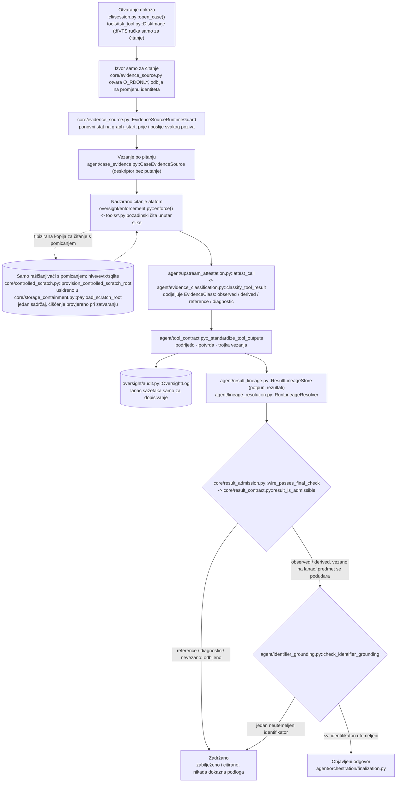
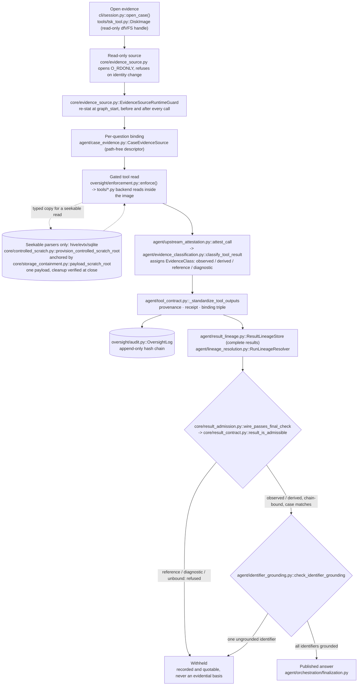

**Hrvatski** · [English](#english)

# Arhitektura forenzičkog agenta

Sustav razdvaja tri stvari: planiranje istrage koje vodi model, determinističku
obradu dokaza i kontrolu izvođenja. Jezični model može odabrati sljedeći
analitički korak, ali ne može sam otvoriti sliku diska niti izvršiti proizvoljnu
naredbu. Odobrenom predmetu pristupa isključivo preko registriranih Python
funkcija čiji se pozivi provjeravaju prije izvođenja.

Nazivi modula i funkcija u ovom dokumentu odnose se na stablo izvornog koda pod
`src/forensic_agent`. Brojevi redaka, gdje su navedeni, služe kao pomoć pri
snalaženju u tom stablu i mogu se pomaknuti kako se kod razvija; stabilne
reference su nazivi modula i funkcija.

## Granice sustava

| Komponenta | Odgovornost |
|---|---|
| **Istražitelj** | Bira predmet, postavlja pitanja, pregledava nalaze i zadržava odgovornost za konačni stručni zaključak. |
| **Orkestracija agenta** | Održava stanje istrage i usklađuje zahtjeve prema modelu, pozive alata, korake oporavka, provjeru i čišćenje. |
| **Jezični model** | Tumači pitanje, predlaže pozive registriranih funkcija i sastavlja nacrt odgovora iz vraćenih nalaza. |
| **Nadzorni sloj** | Provjerava identitet funkcije, argumente, ovlasti, putanje i proračune izvođenja prije nego što se poziv smije izvesti. |
| **Sloj forenzičkih funkcija** | Izlaže ograničene funkcije koje model može pozvati, oslonjene na determinističke analizatore i uhodane forenzičke alate. |
| **Dokazni izvori** | Slike diska, snimke memorije, snimke mrežnog prometa i odobreni izvedeni artefakti, otvoreni bez mijenjanja izvora. |
| **Standardizirani nalazi** | Ujednačuju status alata, podrijetlo, pokrivenost, upozorenja, straničenje i metapodatke o cjelovitosti sadržaja. |
| **Provjera i izvještavanje** | Povezuju tvrdnje iz odgovora s prikupljenim nalazima i predstavljaju rezultat istražitelju. |
| **Zapisnik** | Kronološki bilježi pitanja, predložene pozive, odluke nadzornog sloja, nalaze i konačni ishod u `audit.jsonl`, povezane u lanac sažetaka pa je naknadna izmjena uočljiva. |

## Životni ciklus istrage

1. Istražitelj otvara dokazni izvor ili direktorij predmeta i postavlja jedno
   istražno pitanje.
2. Sustav bira samo funkcije primjenjive na učitane vrste dokaza. Model dobiva
   njihove nazive, opise i strukturirane sheme argumenata.
3. Model predlaže poziv funkcije ili nacrt odgovora. Funkciju ne izvodi sam.
4. Nadzorni sloj provjerava poziv u odnosu na aktivna sigurnosna pravila,
   dopuštene putanje, potrebne ovlasti i preostali proračun izvođenja.
5. Odobreni omotač poziva odgovarajuću forenzičku implementaciju. Odbijen ili
   neispravan poziv ne izvodi se i bilježi se kao strukturirana greška.
6. Sirovi rezultat pretvara se u zajednički ugovor nalaza i vraća u kontekst
   istrage. Model može zatražiti novu funkciju ili sastaviti odgovor iz
   prikupljenih nalaza.
7. Deterministički oporavak može dovršiti nedvosmisleno propušteni korak,
   nastaviti ograničeni rezultat ili prikupiti dokaz koji traži poznati
   sigurnosni uvjet.
8. Završna faza provjerava podrijetlo i pokrivenost, gradi ograničeni prikaz za
   provjeru, izvodi konfiguriranu provjeru odgovora i bilježi konačni izvještaj.
9. Privremeni resursi se zatvaraju, a zapisnik i tragovi nalaza ostaju dostupni
   za pregled.

Model tako ima funkcijski pristup odobrenom predmetu, a ne neograničen pristup
datotečnom sustavu domaćina. Nema opću ljusku i ne može birati proizvoljne
putanje na domaćinu. Granicu predmeta određuje istražitelj kada otvara ili
pridružuje dokaz.

## Orkestracija

`src/forensic_agent/agent/runtime.py` stabilno je javno pročelje.
`run_investigation()` kanonska je programska ulazna točka.

Implementacija jedne istrage organizirana je pod
`src/forensic_agent/agent/orchestration/`:

| Modul | Odgovornost |
|---|---|
| `runner.py` | Definira ovisnosti istrage i internu implementaciju `_execute_investigation()`. |
| `state.py` | Definira nepromjenjivu konfiguraciju, pripremljene resurse i promjenjivo stanje istrage. |
| `preparation.py` | Gradi klijent modela, skup vidljivih funkcija, proračune, zaštite dokaza, tragove i resurse kontroliranog radnog prostora. |
| `coordinator.py` | Drži granicu transakcije i određuje redoslijed analize, oporavka, završne faze i čišćenja. |
| `investigation.py` | Vodi fazu analize koju vodi model te prikuplja poruke i rezultate funkcija. |
| `recovery.py` | Primjenjuje ograničene determinističke nastavke kada početna faza ostavi popravljiv propust. |
| `finalization.py` | Gradi i provjerava izvještaj, primjenjuje provjere prije objave, bilježi telemetriju i zatvara resurse. |

Orkestrator ne raščlanjuje forenzičke dokaze. Njegova je uloga čuvati stanje i
nametnuti redoslijed kojim se pozivaju model, registrirane funkcije, provjera i
čišćenje. Konkretni deterministički nastavci izdvojeni su pod
`src/forensic_agent/agent/recovery/`; faza orkestracije aktivira ih samo kada su
njihovi izričiti preduvjeti ispunjeni. `agent/deterministic_recovery.py` jedina
je površina koja sastavlja sve ograničene obitelji oporavka koje orkestracija
koristi, uključujući pravila za dokaze i pokrivenost.

Izvezeni izvještaji razlikuju **izvršni pogon** od **načina rada**. Interaktivna
implementacija bilježi runtime agenta kao izvršni pogon, a nadzirani rad kao
način rada. Polje načina rada nije obavezno u API-ju za izvještavanje pa
izvještaji nastali kroz starije pozivatelje ostaju kompatibilni.

## Forenzičke funkcije i analizatori

Model ne izdaje sirove naredbe alata Volatility, dfVFS, RegRipper ili tshark.
Poziva stabilne Python funkcije s izričitim shemama. Paket
`agent/tool_bindings/` gradi te omotače okrenute prema modelu, dok paket
`tools/` sadrži determinističke implementacije i prilagodnike prema forenzičkim
bibliotekama i vanjskim programima.

Sloj funkcija spaja:

- uhodane biblioteke i alate, među njima dfVFS i TSK, libewf, regipy i libregf,
  RegRipper, Volatility 3 te tshark;
- ograničene domenske funkcije koje spajaju više niskorazinskih operacija u
  jedan pregledan upit;
- dokumentiranu determinističku logiku ondje gdje vanjski alat ne nudi potreban
  stabilan ugovor.

Načelo oblikovanja jest da se forenzičko *čitanje* prepušta uhodanim pozadinskim
alatima, a okvir na to dodaje samo ograničeno i dokumentirano tumačenje. Svaki
rezultat imenuje komponentu i verziju koja ga je proizvela. Ondje gdje okvir
ipak sam nešto odlučuje, ta je logika općenita: ne nosi oznaku predmeta ni
očekivani odgovor, a na rezultatu objavljuje što je odlučila i koji je čitač dao
svaku podlogu, pa se rasuđivanje može ponovno izvesti iz zapisa umjesto da se
uzima na povjerenje.

### Gdje okvir dodaje tumačenje

Manji dio forenzičke logike izveden je unutar projekta i ovdje je popisan. Pri
čitanju su važne dvije razlike.

Prvo, prepuštanje alatu ima prednost gdje god alat može donijeti odluku. Granice
imena domena čitaju se iz Public Suffix Lista kroz **libpsl**
(`tools/public_suffix.py`); vrstu sadržaja određuje **libmagic**; bajtovi
vrijednosti u registru čitaju se kroz tipizirane pristupnike biblioteke libregf,
uz čitač imenovan na svakom retku. Ništa o imenu, vrsti ili vrijednosti u ovom
projektu ne odlučuje tablica ako to može odlučiti instalirani čitač, a domaćin
bez instaliranog čitača za to polje ne prijavljuje ništa umjesto da oživljava
pogađanje.

Drugo, preostala vlastita logika dijeli se na dvije vrste, a ta razlika određuje
kako se može provjeriti:

- Logika koja odlučuje **što rezultat kaže** provjerljiva je: čitatelj ima
  artefakt i pravilo pa može ponoviti očitanje. Primjeri su obrat lokalnog
  vremena za FAT u `tools/tsk_tool.py`, koji poništava korak kodiranja
  pozadinskog alata i objavljuje vraćeno zidno vrijeme u vlastitom bloku
  `derived_local_wall_clock` označenom s `is_upstream_observation: false`, nikada
  ne prepisujući izvorne vremenske oznake; te signal ZIP-a iz vodećeg bajta u
  `tools/payload_identification.py`, koji se prijavljuje samo uz vlastiti odgovor
  biblioteke libmagic i nikada se s njim ne stapa.
- Logika koja odlučuje **dokle poziv doseže** upravlja negativnim nalazima pa se
  objavljuje kao strukturirano odbijanje, a ne kao prazan rezultat. Pravilo o
  pratećim datotekama dnevnika u `tools/sqlite_tool.py` odbija otvoriti bazu
  unutar slike kada uz nju stoji WAL, dijeljena memorija, rollback, super- ili
  statement-journal, ili kada popis nadređenog direktorija ne može dokazati da
  tih pratećih datoteka nema, i nosi vlastiti zapis `journal_coverage` pa
  odbijanje nikada nije prešutan negativan nalaz. Odabir domaćina između snimki u
  `tools/pcap_tool.py` odlučuje samo koja od tsharkovih krajnjih točaka nosi
  naziv `linked_machine`, objavljuje pravilo kao `selection_rule` i kod
  izjednačenja ne imenuje nikoga.

Zajedničko im je svojstvo da svaka vlastita odluka na rezultatu navodi što je
odlučeno i na temelju čega, pa čitatelj to može ponovno izvesti umjesto da
prihvati na povjerenje.

## Cjelovitost dokaza i kontrolirani radni prostor

Izvorni dokaz otvara se samo za čitanje. Većina analizatora radi izravno kroz to
sučelje. Raščlanjivači registra, EVTX-a i SQLite-a mogu tražiti lokalnu datoteku
po kojoj se može pomicati; za takve pozive sustav stvara tipiziranu privremenu
kopiju unutar kontroliranog radnog direktorija. Model tu putanju na domaćinu
niti bira niti vidi.

Svaki poziv dobiva izdvojeno radno područje. Čišćenje sesije provjerava da su
privremene kopije i njihovi direktoriji uklonjeni. To štiti izvorni dokaz i
sužava ponašanje aplikacije, ali ne zamjenjuje kontrole pristupa operacijskog
sustava, sigurno brisanje ni laboratorijsku izolaciju.

`core/evidence_source.py` upravlja identitetom i životnim ciklusom izvora.
`agent/evidence_custody.py` provjerava da se prethodno otvoreni izvor nije
promijenio tijekom izvođenja.

### Životni ciklus dokaza od početka do kraja

Jedno očitanje putuje od otvorenog izvora do objavljene ili zadržane rečenice, a
o tome odlučuje razred koji mu je dodijeljen. Izvor otvara samo za čitanje
`cli/session.py::open_case()`, pri čemu slika diska postaje dfVFS ručka samo za
čitanje u `tools/tsk_tool.py::DiskImage`, a
`core/evidence_source.py::EvidenceSourceRuntimeGuard` ponovno provjerava njegovo
stanje prije i poslije svakog poziva. Raščlanjivač kojemu treba pomicanje po
datoteci (registar, EVTX, SQLite) čita tipiziranu kopiju u
`core/controlled_scratch.py`, nikada izvor. Razred se dodjeljuje jednom, u
`agent/evidence_classification.py::classify_tool_result` iza
`agent/upstream_attestation.py::attest_call`, standardizira se u potvrdu kroz
`agent/tool_contract.py`, veže na lanac samo za dopisivanje u
`oversight/audit.py::OversightLog`, zadržava u
`agent/result_lineage.py::ResultLineageStore` i naposljetku prosuđuje u
`core/result_admission.py::wire_passes_final_check` i
`agent/identifier_grounding.py::check_identifier_grounding`. Očitanje razreda
`reference` ili `diagnostic` odbija se kao dokazna podloga pri prihvatu; i dalje
se bilježi i može se citirati.

## Nadzor i proračuni izvođenja

Svaki poziv koji model predloži prolazi kroz nadzorni sloj prije nego što se
pripadna funkcija smije izvesti. Aktivna sigurnosna pravila provjeravaju:

- je li funkcija registrirana i vidljiva u trenutnom zadatku;
- odgovaraju li argumenti shemi funkcije i dopuštenim vrijednostima;
- ima li sesija potrebnu ovlast;
- ostaju li putanje na domaćinu unutar odobrenih korijena;
- ostaje li još prostora u ograničenjima broja zahtjeva prema modelu, poziva
  funkcija, veličine izlaza i vremena;
- jesu li poziv i njegov ishod zabilježeni u zapisniku.

Modelu nije izložena nikakva opća funkcija `shell`, pokretač proizvoljnih
procesa ni neograničen čitač datoteka. Vanjski programi pozivaju se samo unutar
odobrenih implementacija funkcija.

## Standardizirani nalazi i podrijetlo

Sirovi izlazi različitih forenzičkih alata bitno se razlikuju. Interni ugovor
`forensic.tool-result.v2`, definiran u `core/result_contract.py`, daje zajednički
prikaz koji sadrži:

- status uspjeha ili strukturirane podatke o grešci;
- identitet funkcije i implementacije;
- neprozirni identitet dokaza i lokator artefakta;
- strukturirane retke ili ograničeni sadržaj;
- pokrivenost pretrage i stanje dovršenosti;
- upozorenja, skraćivanje i metapodatke o nastavku;
- sažetak kanonskog sadržaja nalaza.

Nadiđeni `forensic.tool-result.v1` ostaje u `core/tool_result.py`, samo za
čitanje, kako bi povijesni zapisi i dalje opisivali ugovor pod kojim su nastali.
Živi rezultat pratite kroz `core/result_contract.py`, ne kroz taj modul.

Ugovor se može preslikati u strukturirani izlaz u stilu MCP-a, ali sam ugovor ne
čini aplikaciju MCP poslužiteljem i ne uspostavlja forenzičku valjanost.
Podrijetlo, rukovanje dokazima samo za čitanje, provjera argumenata i neovisan
pregled ostaju zasebni zahtjevi.

## Provjera, izvještavanje i zapisnik

Sloj pouzdanosti pri gradnji prikaza za provjeru prihvaća samo valjane
standardizirane nalaze. Za podržane strukturirane artefakte koristi se
deterministička sinteza, dok ograničeni zahtjev prema modelu može provjeriti
nacrt odgovora u odnosu na prihvaćene nalaze. Ako su dostupni dokazi nepotpuni,
rezultat mora pokazati to ograničenje umjesto da nepotkrijepljenu tvrdnju
predstavi kao utvrđenu činjenicu.

Zapisnik razlikuje neuspjehe u obradi dokaza, analitičkom planiranju, tumačenju,
provjeri i ocjenjivanju. Bilježi vidljive događaje potrebne za rekonstrukciju
istrage, ali ne otkriva privatni tijek razmišljanja. Datoteke zapisnika mogu
sadržavati osjetljive putanje ili vrijednosti izvedene iz dokaza pa se moraju
štititi kao materijal predmeta.

## Pružatelji modela

Pružatelj je izvan granice obrade dokaza. Interaktivni rad podržava konfigurirane
udaljene ili lokalne krajnje točke modela. Izbor pružatelja i modela operativno je
svojstvo pojedinog izvođenja i bilježi se uz uputu poslanu modelu, registar alata
i identitet koda za to izvođenje. Podrška za lokalno izvođenje operativna je mogućnost, a ne
svojstvo sloja za obradu dokaza.

## Doseg tvrdnje

Ova arhitektura poboljšava kontrolu, sljedivost i mogućnost pregleda. Sama po
sebi ne dokazuje da je agent točniji od neograničenog modela i nije certificirani
forenzički proizvod. Za provjeru i konačni stručni zaključak i dalje odgovara
kvalificirani vještak.

---

[Hrvatski](#hrvatski) · **English**

# Forensic Agent Architecture

The system separates three concerns: model driven investigation planning,
deterministic evidence processing, and execution control. The language model may
select the next analytical action, but it cannot open an evidence image or execute
an arbitrary command. It can access an approved case only through registered
Python functions whose calls are validated before execution.

Module and function names in this document refer to the source tree under
`src/forensic_agent`. Line numbers, where given, are navigation aids into that
tree and may drift as the code evolves; the module and function names are the
stable references.

## System boundaries

| Component | Responsibility |
|---|---|
| **Investigator** | Selects a case, asks questions, reviews findings, and retains responsibility for the final professional conclusion. |
| **Agent orchestration** | Maintains investigation state and coordinates model requests, function calls, recovery steps, verification, and cleanup. |
| **Language model** | Interprets the question, proposes registered function calls, and drafts an answer from returned findings. |
| **Oversight layer** | Validates function identity, arguments, capabilities, paths, and execution budgets before a call may run. |
| **Forensic function layer** | Exposes bounded, model callable functions backed by deterministic analyzers and established forensic tools. |
| **Evidence sources** | Disk images, memory captures, network captures, and approved derived artifacts opened without modifying the source. |
| **Standardized findings** | Normalize tool status, provenance, coverage, warnings, pagination, and content integrity metadata. |
| **Verification and reporting** | Relate answer claims to collected findings and present the result to the investigator. |
| **Run record** | Records questions, proposed calls, oversight decisions, findings, and the final outcome in `audit.jsonl` in chronological order, hash-chained so later modification is detectable. |

## Investigation lifecycle

1. The investigator opens an evidence source or case directory and asks one
   investigation question.
2. The system selects only the functions applicable to the loaded evidence types.
   The model receives their names, descriptions, and structured argument schemas.
3. The model proposes a function call or an answer draft. It does not execute the
   function itself.
4. The oversight layer checks the call against the active policy, allowed paths,
   required capabilities, and remaining execution budget.
5. An approved wrapper invokes the corresponding forensic implementation. A
   rejected or malformed call is not executed and is recorded as a structured
   error.
6. The raw result is converted to the common finding contract and returned to the
   investigation context. The model may request another function or draft an
   answer from the collected findings.
7. Deterministic recovery may complete an unambiguous missing step, continue a
   bounded result, or gather evidence required by a known safety condition.
8. Finalization checks provenance and coverage, constructs a bounded verification
   view, performs the configured answer verification, and records the final report.
9. Temporary resources are closed and the run record and the finding traces
   remain available for review.

The model therefore has functional access to the approved case, not unrestricted
access to the host file system. It has no general shell and cannot select arbitrary
host paths. The investigator defines the case boundary when evidence is opened or
attached.

## Orchestration

`src/forensic_agent/agent/runtime.py` is the stable public facade.
`run_investigation()` is the canonical programmatic entry point.

The implementation of one investigation is organized under
`src/forensic_agent/agent/orchestration/`:

| Module | Responsibility |
|---|---|
| `runner.py` | Defines investigation dependencies and the internal `_execute_investigation()` implementation. |
| `state.py` | Defines immutable configuration, prepared resources, and mutable investigation state. |
| `preparation.py` | Builds the model client, visible function set, budgets, evidence guards, traces, and controlled scratch resources. |
| `coordinator.py` | Owns the transaction boundary and orders analysis, recovery, finalization, and cleanup. |
| `investigation.py` | Runs the model driven analysis phase and collects messages and function results. |
| `recovery.py` | Applies bounded deterministic continuations when the initial phase leaves a recoverable gap. |
| `finalization.py` | Builds and verifies the report, applies publication checks, records telemetry, and closes resources. |

The orchestrator does not parse forensic evidence. Its role is to preserve state
and enforce the sequence in which the model, registered functions, verification,
and cleanup are invoked. Concrete deterministic continuations are isolated under
`src/forensic_agent/agent/recovery/`; the orchestration phase activates them only
when their explicit preconditions are satisfied. `agent/deterministic_recovery.py`
is the single surface that composes all bounded recovery families consumed by
orchestration, evidence and coverage rules included.

Exported reports distinguish the **runtime engine** from the **operation mode**.
The interactive implementation records the agent runtime as the runtime engine and
supervised as the operation mode. The operation-mode field is optional in the
reporting API so reports produced through older callers remain compatible.

## Forensic functions and analyzers

The model does not issue raw Volatility, dfVFS, RegRipper, or tshark
commands. It calls stable Python functions with explicit schemas. The
`agent/tool_bindings/` package builds these model facing wrappers, while the `tools/`
package contains the deterministic implementations and adapters to forensic
libraries and external programs.

The function layer combines:

- established libraries and tools, including dfVFS and TSK, libewf, regipy and
  libregf, RegRipper, Volatility 3, and tshark;
- bounded domain functions that combine several low level operations into one
  reviewable query;
- documented deterministic logic where an external tool does not provide the
  required stable contract.

The design principle is that forensic *reading* is delegated to established
backends, and the harness adds only bounded, documented interpretation on top of
them. Each result names the component and the version that produced it. Where the
harness does decide something itself, that logic is generic: it carries no case
identifier and no expected answer, and it publishes on the result what it decided
and which reader supplied each underlying value, so the reasoning is re-derivable
from the record rather than taken on trust.

### Where the harness adds interpretation

A small amount of forensic logic is implemented in-house, and it is enumerated
here. Two distinctions matter when reading it.

First, delegation is preferred wherever a tool can carry the decision. Domain-name
boundaries are read from the Public Suffix List through **libpsl**
(`tools/public_suffix.py`); payload type is decided by **libmagic**; registry
value bytes are read through libregf's typed accessors, with the reader named on
each row. Nothing about a name, a type, or a value is decided by a table in this
project where an installed reader can decide it, and a host with no reader
installed reports nothing for that field rather than reviving a guess.

Second, the remaining in-house logic divides into two kinds, and the distinction
governs how it can be checked:

- Logic that decides **what a result says** is checkable: a reader holds the
  artifact and the rule and can re-derive the reading. Examples are the FAT
  local-time reversal in `tools/tsk_tool.py`, which inverts a backend encoding
  step and publishes the recovered wall clock in its own `derived_local_wall_clock`
  block marked `is_upstream_observation: false`, never overwriting the source
  timestamps; and the leading-byte ZIP signal in
  `tools/payload_identification.py`, reported only beside libmagic's own answer and
  never merged into it.
- Logic that decides **what a call reaches** governs negative findings, and so is
  published as a structured refusal rather than an empty result. The
  journal-companion rule in `tools/sqlite_tool.py` refuses to open an in-image
  database when a WAL, shared-memory, rollback, super- or statement-journal
  companion sits beside it, or when the parent listing cannot prove those
  companions absent, and carries its own `journal_coverage` record so the refusal
  is never a silent negative. The cross-capture host selection in
  `tools/pcap_tool.py` decides only which of tshark's own endpoints is named
  `linked_machine`, publishing the rule as `selection_rule` and naming nobody on a
  tie.

The common property is that each in-house decision states, on the result, what it
decided and on what basis, so a reader can re-derive it rather than accept it.

## Evidence integrity and controlled scratch space

Original evidence is opened read only. Most analyzers work directly through that
interface. Registry, EVTX, and SQLite parsers may require a seekable local file;
for those calls the system creates a typed temporary copy inside a controlled
scratch directory. The model neither selects nor sees the host path.

Each call receives an isolated working area. Session cleanup verifies that
temporary copies and their directories have been removed. This protects the
source evidence and constrains application behavior, but it is not a substitute
for operating system access controls, secure deletion, or laboratory isolation.

`core/evidence_source.py` manages source identity and lifecycle.
`agent/evidence_custody.py` verifies that a previously opened source has not
changed during execution.

### The evidence lifecycle, end to end

A single reading travels from an opened source to either a published sentence or
a withheld one, and the class it was given decides which. The source is opened
read-only by `cli/session.py::open_case()` — a disk image becomes a read-only
dfVFS handle in `tools/tsk_tool.py::DiskImage` — and
`core/evidence_source.py::EvidenceSourceRuntimeGuard` re-stats it before and
after every call. A seekable parser (registry, EVTX, SQLite) reads a typed copy
in `core/controlled_scratch.py`, never the source. The class is assigned once, in
`agent/evidence_classification.py::classify_tool_result` behind
`agent/upstream_attestation.py::attest_call`, standardized into a receipt by
`agent/tool_contract.py`, bound to the append-only chain by
`oversight/audit.py::OversightLog`, retained by
`agent/result_lineage.py::ResultLineageStore`, and finally judged by
`core/result_admission.py::wire_passes_final_check` and
`agent/identifier_grounding.py::check_identifier_grounding`. A `reference` or
`diagnostic` reading is refused as an evidential basis at admission; it is still
recorded and quotable.

## Oversight and execution budgets

Every model proposed call passes through the oversight layer before the underlying
function can run. The active policy checks:

- whether the function is registered and visible in the current task;
- whether arguments conform to the function schema and allowed values;
- whether the session has the required capability;
- whether host paths remain within approved roots;
- whether model request, function call, output size, and time limits remain;
- whether the call and its outcome are recorded in the run record.

No general `shell` function, arbitrary process launcher, or unrestricted file
reader is exposed to the model. External programs are invoked only inside approved
function implementations.

## Standardized findings and provenance

Raw outputs from different forensic tools vary substantially. The internal
`forensic.tool-result.v2` contract, defined in `core/result_contract.py`, provides
a common representation containing:

- success status or structured error information;
- function and implementation identity;
- opaque evidence identity and an artifact locator;
- structured rows or bounded content;
- search coverage and completion state;
- warnings, truncation, and continuation metadata;
- a digest of the canonical finding content.

The superseded `forensic.tool-result.v1` remains in `core/tool_result.py`, read
only, so historical records keep describing the contract they were written under.
Follow a live result through `core/result_contract.py`, not through that module.

The contract can be mapped to MCP style structured output, but the contract itself
does not make the application an MCP server and does not establish forensic
validity. Provenance, read only evidence handling, argument validation, and
independent review remain separate requirements.

## Verification, reporting, and the run record

The reliability layer accepts only valid standardized findings when constructing
the verification view. Deterministic synthesis is used for supported structured
artifacts, while a bounded model request may verify the answer draft against the
accepted findings. If the available evidence is incomplete, the result must expose
that limitation rather than present an unsupported claim as established fact.

The run record distinguishes failures in evidence processing, analytical planning,
interpretation, verification, and scoring. It records observable events needed to
reconstruct the investigation, but it does not expose private chain of thought.
Record files may contain sensitive paths or evidence derived values and must be
protected as case material.

## Model providers

The provider is outside the evidence processing boundary. Interactive operation
supports configured remote or local model endpoints. The choice of provider and
model is an operational property of a run and is recorded alongside the prompt,
tool registry, and code identity for that run. Support for local execution is an
operational option, not a property of the evidence-processing layer.

## Scope of the claim

This architecture improves control, traceability, and reviewability. It does not
by itself prove that the agent is more accurate than an unconstrained model, and
it is not a certified forensic product. A qualified examiner remains responsible
for verification and the final professional conclusion.
