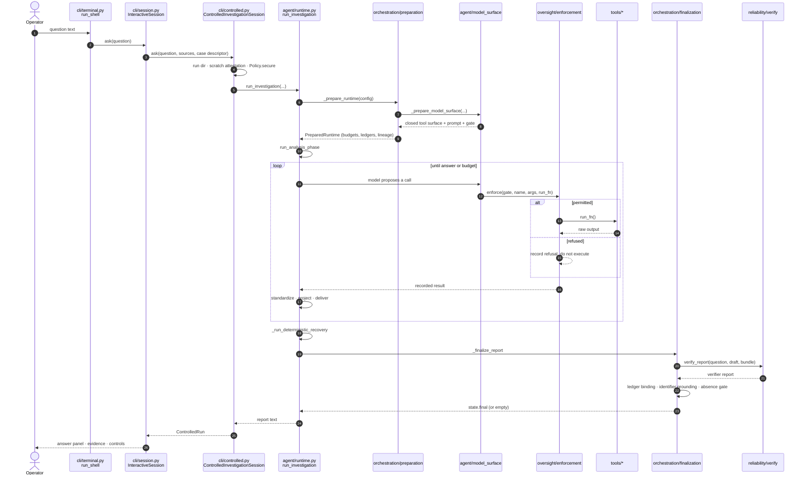
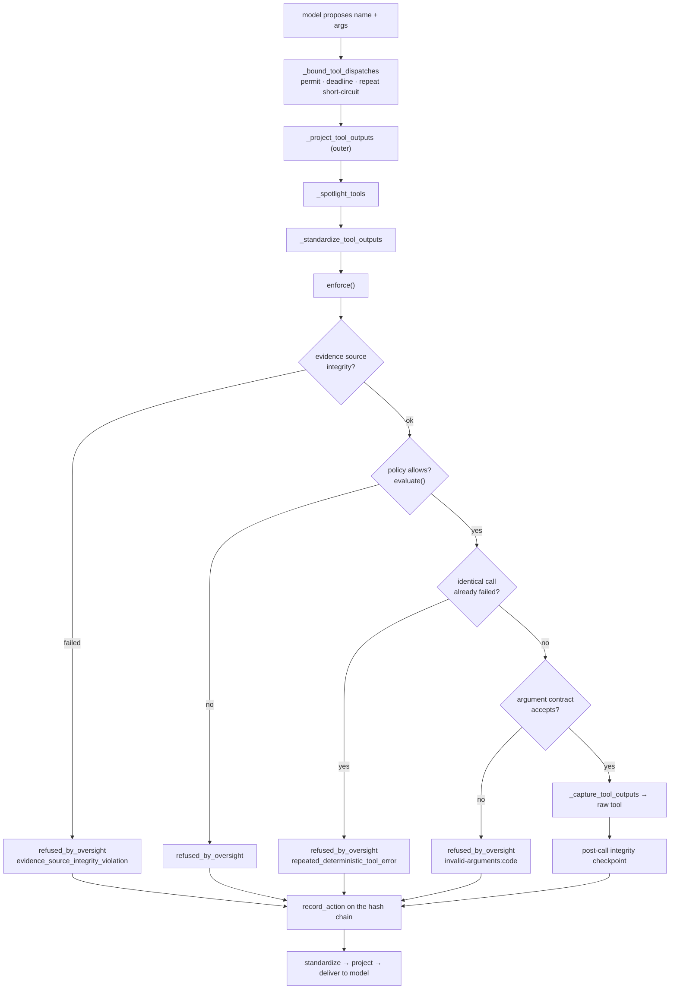
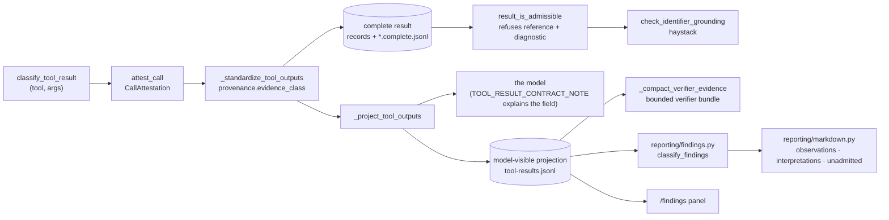
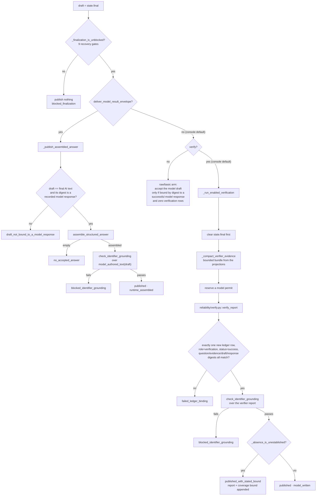
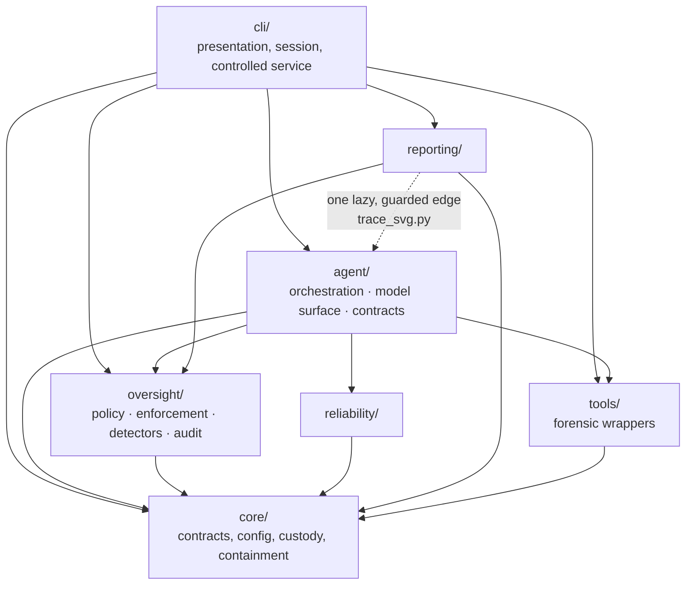

<a id="hrvatski"></a>

**Hrvatski** · [English](#english)

# Detalji arhitekture: put izvođenja, redom

Ovo je pogled održavatelja. Prati jedno stvarno pitanje od operaterovog pritiska
tipke do objavljenog odgovora, imenujući svaki modul kroz koji prolazi i ono što
svaki od njih doprinosi, a zatim isto radi za četiri jednako važna puta: kako se
predmet otvara i veže, kako poziv alata prolazi kroz kontrolnu točku i kako se
bilježi, kako rezultat postaje nalaz i kako se odgovor provjerava ili odbija.
Posljednji odjeljak navodi pravila slojeva i izvještava drže li se.

Imena modula i funkcija odnose se na stablo izvornog koda pod
`src/forensic_agent`. Brojevi redaka pomoć su pri navigaciji kroz to stablo i mogu
se pomaknuti kako se kod razvija; stabilne su reference imena modula i funkcija.
Argument povjerenja izgrađen nad ovim putem nalazi se u
[Pregledu arhitekture](ARCHITECTURE_OVERVIEW.md); popis forenzičke logike
implementirane unutar samog projekta nalazi se u
[Arhitekturi](ARCHITECTURE.md#where-the-harness-adds-interpretation).

---

## A. Jedno pitanje, od pritiska tipke do objavljenog odgovora

### A.1 Konzola

`forensic_agent/__main__.py::main()` (ili konzolna skripta `dfir-agent`, koja
pokazuje na `forensic_agent.cli:main` i u potpunosti zaobilazi `__main__.py`)
poziva `cli/app.py::main()`, koji omata `_run_cli()` u vraćanje pozadine
terminala. `_run_cli()` raščlanjuje argumente, vraća spremljeni jezik
(`cli/i18n.py`) i razinu zaključivanja (`cli/reasoning.py`), razrješava ili
pokreće postavljanje pružatelja (`cli/setup.py`), konstruira
`cli/app.py::Session`, podrazred razreda `cli/session.py::InteractiveSession` s
ubrizganom fasadnom konzolom, i ulazi u `cli/terminal.py::run_shell()`, petlju
naredbi.

Redak koji nije `/command` dolazi do `InteractiveSession.ask()`
(`cli/session.py`). Odmah odbija ako nijedan dokaz nije učitan, ispisuje zaglavlje
razmjene, po potrebi ispisuje redak trijaže dokaza iz `core/evidence_probe.py`, a
zatim poziva kontrolirani pokretač.

### A.2 Kontrolirana usluga

`InteractiveSession._controlled_runner()` gradi, jednom po konfiguraciji modela,
`cli/controlled.py::ControlledInvestigationSession` kroz
`cli/model_request.py::build_controlled_runner()`. Zadane vrijednosti konzole su
`max_steps=20`, `max_tool_calls=20`, `max_model_requests=23`,
`max_wall_time_s=900.0` (`cli/controlled.py`).

`InteractiveSession.ask()` zatim poziva `ControlledInvestigationSession.ask()` s
pitanjem (kojemu je kontekst razgovora dodan na početak kroz
`cli/model_request.py::question_with_history_context()`), priloženim izvorima,
identitetom predmeta, opisnikom predmeta bez putanja i
`tool_exposure=TOOL_EXPOSURE_HIDE_UNAVAILABLE`, jer interaktivna paleta skriva
funkcije koje ovaj domaćin ne može izvršiti.

`ControlledInvestigationSession.ask()` mjesto je na kojem se odlučuju kontrole
izvođenja:

1. Identifikator izvođenja i privatni direktorij izvođenja `run_dir` s načinom
   pristupa `0o700`. Ovdje su fiksirane četiri putanje zapisa: `audit.jsonl`,
   `oversight.jsonl`, `tool-results.jsonl` i kasnije `failure.json`.
2. Kontrolirani radni prostor. `_scratch_anchor()` sidri ga unutar
   `core/storage_containment.py::payload_scratch_root()` kada raspoređivanje
   deklarira pohranu privatnu za spremnik, a inače se vraća na direktorij
   izvođenja. `core/controlled_scratch.py::provision_controlled_scratch_root()`
   stvara ga i ovjerava; `ControlledScratchSession` posjeduje ga tijekom izvođenja
   i pri zatvaranju provjerava da ništa nije ostalo iza.
3. Paleta alata. `_relevant_tools()` presijeca funkcije primjenjive na učitane
   vrste dokaza (`agent/tool_palette.py`) s imenima koja je
   `agent/tool_registry.py::build_tools()` stvarno proizveo na ovom domaćinu.
   Sirovi alati grade se ovdje, uz `capture=False, project=False`, jer modelska
   površina posjeduje cijeli lanac omotača.
4. `_refuse_unavailable_required_tools()` prekida prije bilo kojeg zahtjeva
   modelu ako se tražena funkcija ne može izvršiti na ovom domaćinu.
5. `_evidence_roots()` prikuplja nadređeni direktorij svakog priloženog izvora te
   sve deklarirane korijene predmeta. `_assert_captures_within_roots()` ograničava
   svaku vezanu snimku mrežnog prometa na te korijene.
6. Sigurnosna pravila. `Policy.secure(path_roots=roots,
   work_dirs=[scratch.session_path], allowed_tools=set(executable_tools),
   allow_network=False, allow_write=True, allow_spawn=True,
   controlled_scratch_attestation_sha256=…, controlled_scratch_root=…)`. Njihovo
   konstruiranje ponovno ovjerava korijen radnog prostora; vidi
   [C.5](#hr-c5-doseg-pisanja).
7. `_decoding_controls()` zamrzava profil dekodiranja, deterministički profil sa
   `seed=42`, i parametre zahtjeva s popisa dopuštenih.
8. `_controlled_tool_runtime()` preusmjerava `TMPDIR`/`TMP`/`TEMP`, radne
   direktorije i direktorije predmemorije alata Volatility, `HOME` i XDG korijene
   u radnu sjednicu za trajanje poziva, a `_provider_routing_environment()`
   fiksira usmjeravanje prema pružatelju.

Zatim poziva `agent/runtime.py::run_investigation()`.

### A.3 Fasada izvođenja i faze

`run_investigation()` tanka je i stabilna fasada: razrješava zamjenjive
ovisnosti (`ChatOpenAI`, tvornicu agenata, graditelja modelske površine) i
delegira na `agent/orchestration/runner.py::_execute_investigation()`, koji pakira
svaki argument u zamrznuti `InvestigationConfig` (`agent/orchestration/state.py`)
i izvodi dva koraka:

```
_prepare_runtime(config, …)        agent/orchestration/preparation.py
_execute_runtime(runtime)          agent/orchestration/coordinator.py
```

`_prepare_runtime()` provjerava kontrole, konstruira spremišta zapisa za
izvođenje i točnu površinu vidljivu modelu te vraća zamrznuti `PreparedRuntime`.
Redom stvara:

| Što | Gdje | Zašto postoji |
|---|---|---|
| `EvidenceSourceRuntimeGuard` | `core/evidence_source.py`, povezan u `preparation.py` | Ponovno provjerava da se fizički izvor nije promijenio, na imenovanim kontrolnim točkama. |
| `ResultLineageStore` | `agent/result_lineage.py`, `preparation.py` | Drži svaki potpuni standardizirani rezultat po identifikatoru poziva, i sažetke onoga što je modelu stvarno predano. |
| `ResultNavigator` | `agent/result_navigator.py`, `preparation.py` | Izdaje i unovčava neprozirni pokazivač stranice koji nosi skraćena projekcija. |
| `ResultReferenceRegistry` | `agent/result_reference.py`, `preparation.py` | Imenuje svaku isporuku modelu. Stvara se **samo** kada je `deliver_model_result_envelope` uključen. |
| `RunLineageResolver` | `agent/lineage_resolution.py`, `preparation.py` | Pouzdani odgovor izvođenja na pitanje na čemu tvrdnja smije počivati: ovjereni izvori, zadržani rezultati i nadzorni lanac. Veže se na zapisivač nakon što lanac postoji. |
| `_CellExecutionBudget`, `_FrozenRequestTimeout` | `agent/execution_budget.py` | Apsolutni vremenski rok uz odvojene gornje granice za zahtjeve modelu, pozive alata i navigaciju po pohranjenim rezultatima. |
| `_ModelRequestLedger` ×2 | `agent/model_telemetry.py`, `preparation.py` | Knjige zahtjeva po ulozi (`investigation`, `forced_final`) čiji retci nose sažetak sadržaja odgovora. |
| `_RequestPayloadLedger` | `agent/model_transport.py` | Sažima odlazne sadržaje zahtjeva. |

Zatim poziva `agent/model_surface.py::_prepare_model_surface()` (vidi
[odjeljak C](#hr-c-jedan-poziv-alata)), omata dobivene alate u granice otpreme,
uspoređuje ostvarene sažetke sustavskog upita i registra alata s očekivanom bravom
ako je zadana, konstruira klijenta modela i tek onda gradi graf agenta:
`create_agent_runtime(llm, tools, prompt=prompt)`, koji poziva
`langchain.agents.create_agent`.

`_execute_runtime()` (koordinator) gradi početno stanje `InvestigationState`.
Svaki blok metrika stvara se unaprijed, a njegova zastavica `enabled` izvodi se iz
konfigurirane grane, pa se onemogućena faza bilježi kao onemogućena, a ne kao
odsutna. Sve se izvodi unutar jednog konteksta `cell_deadline(...)` i jednog
`finally`:

```
run_analysis_phase(runtime, state)          orchestration/investigation.py
_run_deterministic_recovery(runtime, state) orchestration/recovery.py
_finalize_report(runtime, state)            orchestration/finalization.py
finally: _finalize_runtime(runtime, state)  orchestration/finalization.py
```

### A.4 Faza analize

`run_analysis_phase()` uzima najam za čitanje na čuvaru dokaza i izvodi kontrolnu
točku cjelovitosti `graph_start` (potpuni sažetak sadržaja ako ovo izvođenje
posjeduje čuvara, samo metapodatke ako je adapter već platio punu provjeru), a
zatim tokovno izvodi ReAct petlju:

```python
runtime.agent.stream(
    {"messages": [("user", runtime.prepared.model_question)]},
    config={"recursion_limit": config.max_steps * 2 + 5,
            "callbacks": [runtime.investigation_ledger]},
    stream_mode="values",
)
```

Ako prvi prolaz ne proizvede ni poziv alata ni ikakav tekst modela, ponavlja se do
tri puta uz stanku od 2 s (`_MAX_INVESTIGATION_ATTEMPTS`,
`_INVESTIGATION_RETRY_BACKOFF_S`), jer prazan uvodni potez inače gubi cijelo
izvođenje s neutrošenim proračunom. `_DispatchDenied` (iscrpljen proračun) i
`GraphRecursionError` hvataju se i pretvaraju u zastavice stanja umjesto u
iznimke, pa prikupljeni dokazi preživljavaju do oporavka.

### A.5 Deterministički oporavak

`_run_deterministic_recovery()` ograničen je, determinističan i nikada ne izmišlja
nalaz. Njegove faze, svaka sa svojim blokom metrika i svojom zastavicom
`*_blocked`:

* zatvara pozive alata koje je model ostavio bez odgovora kada je proračun alata
  iscrpljen (`agent/recovery/pending_tool_recovery.py::close_refused_tool_calls`)
  te oporavlja ili ispravlja neispravno oblikovan završni poziv alata
  (`correct_malformed_final_tool_call`);
* nastavlja ograničeni rezultat na kojem je model stao
  (`agent/deterministic_recovery.py::_follow_unique_content_continuation`,
  `_follow_unique_match_with_continuation`, `_follow_unique_configuration_inspection`,
  `_follow_memory_query_pagination`);
* pokrivenost više izvora (`agent/recovery/multisource_coverage.py`), upozorenja o
  područjima dokaza (`evidence_region_advisory.py`), nedovršeno ispitivanje
  (`unfinished_examination.py`), neproduktivno ponavljanje
  (`unproductive_repetition.py`), preuranjena odsutnost (`premature_absence.py`),
  granica rezultata (`result_frontier.py`) i granica pokrivenosti
  (`coverage_bound.py`);
* **rezervirani završni zahtjev** (`recovery.py`). Ako izvođenje nema upotrebljiv
  nacrt i nijedna kontrolna točka ne blokira, model se jednom pita, točno iz
  poruka koje su već prikupljene, za njegov zaključak, uz `recursion_limit: 6` i
  bez alata u zahtjevu. Formulacija je `_PROSE_TERMINAL_REQUEST` u uobičajenom
  slučaju i `STRUCTURED_TERMINAL_REQUEST` pod vezanjem odgovora, a pod tim
  vezanjem od pružatelja se dodatno traži da ograniči odgovor na
  `segment_document_response_format()`. Ako taj potez i dalje ne da ništa
  objavljivo, dopušteno je točno jedno ponovno izdavanje s olakšanim
  zaključivanjem.

Na kraju `_enforce_terminal_tool_call_state()` ponovno provjerava zadnju poruku
nakon svake faze, pa nijedan put ne može objaviti prozu koja počiva na neriješenom
ili neispravno oblikovanom pozivu alata.

### A.6 Dovršavanje

`_finalize_report()` prihvaća odgovor kroz točno jedan od tri međusobno isključiva
puta. Vidi [odjeljak E](#hr-e-kako-se-odgovor-provjerava-ogradjuje-ili-odbija).

`_finalize_runtime()` zatim zatvara resurse skrbništva i nadzora, objavljuje
metrike izvođenja u pozivateljev rječnik `telemetry` i, jer se nalazi u `finally`,
izvodi se bez obzira na to je li dovršavanje podiglo iznimku.

### A.7 Natrag operateru

`ControlledInvestigationSession.ask()` vraća zamrznuti `ControlledRun` koji nosi
tekst izvještaja, identifikator izvođenja, tri putanje zapisa, vidljiva imena
alata i telemetriju. Ako je izvještaj prazan, umjesto toga piše `failure.json` i
podiže `IncompleteExaminationError` **noseći isti zapis**, pa konzola i dalje može
pokazati što je ispitivanje utvrdilo.

`InteractiveSession.ask()` zatim:

* pohranjuje `last_evidence = run.tool_calls()`, nadzorne retke čiji se ishod
  klasificira kao `executed` (koristeći
  `oversight/audit.py::classify_action_outcome`); odbijanje nije pristup dokazu;
* pohranjuje `last_findings = run.standardized_findings()`, svaki redak datoteke
  `tool-results.jsonl`, što je trag projekcije vidljive modelu;
* bilježi odgovor u povijest razgovora (`cli/investigation_history.py`);
* ispisuje ploču s odgovorom uz `answer_source` iz
  `cli/presentation.py::summarize_controls()`, ploču sa sažetkom dokaza i
  upravljačku ploču.



---

## B. Kako se predmet otvara i veže

### B.1 Otvaranje

`/case <path>` dolazi do `InteractiveSession.open_case()` (`cli/session.py`).

* `_handoff_host_path_if_needed()` →
  `cli/host_paths.py::handoff_host_path_if_needed()`, koji tekst najprije
  razrješava unutar aktivno montiranog dokaznog prostora i tek ga onda predaje
  funkciji `cli/host_case_handoff.py::request_host_case_mount()`, pa putanja izvan
  montiranog korijena dokaza postaje zahtjev pokretaču na domaćinu, a ne tiho
  čitanje.
* `_resolve_evidence_path()` → `cli/host_paths.py::resolve_evidence_path()`.
* Direktorij koji sadrži `case.json` čita
  `cli/case_selection.py::case_from_manifest()`. Direktorij bez njega pretražuje
  `cli/case_discovery.py::discover_case_directory()`. Pojedinačna datoteka ide na
  `cli/case_selection.py::case_from_evidence_file()`; slika u formatu RAW ili BIN
  *dvosmislena* je jer je ili slika diska ili ispis memorije, a ništa u datoteci
  ne govori što od toga, pa se priprema da je operater klasificira umjesto da se
  otvori na pretpostavku.
* `_commit_discovered_case()` prilaže izvore, izvodi identifikator predmeta,
  indeksira predmet (`cli/case_index.py`, najbolji trud) i briše prethodnu
  istragu.

Sliku diska otvara `_prepare_disk()`, koji konstruira
`tools/tsk_tool.py::DiskImage`, ručku samo za čitanje nad dfVFS, uz `AuditLog`
koji piše u `case-open.audit.jsonl` i nadzornik napretka
(`cli/case_open_progress.py`) kako bi se višegigabajtni prolaz sažimanja sam
javljao. `DiskImage.__init__` veže identitet skrbništva **prije** nego što dfVFS
išta otvori po putanji, a zatim ponovno provjerava metapodatke nakon
pretraživanja, pa se zamjena putanje ili segmenta tijekom razrješavanja otkriva, a
ne odbacuje kao nemoguća.

### B.2 Vezanje

Otvaranje nije vezanje. Vezanje se izvodi po pitanju, u
`InteractiveSession._case_evidence_binding()`, koji gradi opisnik **bez putanja**:

```
cli/evidence_identity.py::build_interactive_case_evidence_source(...)
    -> agent/case_evidence.py::CaseEvidenceSource
```

Opisnik imenuje komponente po ulozi i identitetu, a ne po lokaciji na domaćinu, pa
ništa nizvodno ne treba putanju da odluči čita li alat pravi izvor. Zatim se
provjerava tri odvojena puta:

1. `ControlledInvestigationSession._validate_case_evidence_source()`
   (`cli/controlled.py`): točan tip, podudarni identifikator predmeta i skup
   aktivnih modaliteta jednak skupu učitanih vrsta izvora.
2. `agent/model_surface.py`: opet točan tip, opet identifikator predmeta i katalog
   PCAP datoteka provjeren u odnosu na opisnik.
3. `agent/model_surface.py`: **svaki modelu vidljiv alat koji nije referentni alat
   mora imati vezanje na izvor**, provjereno prije nego što se klijent modela
   uopće konstruira. `case_evidence_source.source_attributes_for_tool(name)`
   podiže iznimku za alat bez deklariranog vezanja na ulaz raščlanjivača.

Tek tada izvođenje dolazi do modela.

---

<a id="hr-c-jedan-poziv-alata"></a>

## C. Jedan poziv alata

### C.1 Površina

`agent/model_surface.py::_prepare_model_surface()` gradi površinu jednom i vraća
`_PreparedModelSurface(tools, prompt, model_question, gate, identity)`. Omotači se
primjenjuju ovim redoslijedom, pa se u trenutku poziva izvršavaju od najvanjskijeg
prema unutra, obrnutim redom:

| # | Primijenjeno u | Sloj | Doprinos |
|---|---|---|---|
| 1 | `tool_registry.py::build_tools()` ili pozivateljevi `prepared_tools` | sirova funkcija | Stvarni forenzički omotač. |
| 2 | `model_surface.py` | `_filter_model_visible_tools()` | Svodi na tražena imena, uz zatvaranje pri nepoznatom imenu. |
| 3 | `model_surface.py` | `output_guard.py::_capture_tool_outputs()` | Zadržava potpuni izlaz prije oblikovanja u nadzornom spremištu objekata. |
| 4 | `model_surface.py` | `oversight/enforcement.py::wrap_with_oversight()` | **Kontrolna točka.** Svaki poziv prolazi kroz `enforce()`. |
| 5 | `model_surface.py` | `tool_contract.py::_standardize_tool_outputs()` | Gradi podrijetlo, klasu, potvrdu i identifikator poziva; veže ih na nadzorni unos. |
| 6 | `model_surface.py` | `_spotlight_tools()` | Omata izlaz koji nije u omotnici oznakama `«EVIDENCE_DATA»`. |
| 7 | `model_surface.py` | `result_navigator.py::build_result_page_tool()` | Dodan na kraj, nije omotan; vidi [C.4](#hr-c4-jedina-funkcija-bez-kontrolne-tocke). |
| 8 | `model_surface.py` | `output_guard.py::_project_tool_outputs()` | Ograničava modelovu kopiju; izdaje pokazivač stranice i referencu isporuke. |
| 9 | `preparation.py` | `execution_dispatch.py::_bound_tool_dispatches()` | Rezervira dozvolu, izvodi u radniku vezanom na rok ćelije, kratko spaja već odbijen identičan poziv. |

Identitet površine, `sha256` sustavskog upita i kanonskog registra alata u OpenAI
formatu, računa se u `model_surface.py` i upravo je to ono što zabilježeni
identitet izvođenja fiksira.

### C.2 Kontrolna točka



`enforce()` (`oversight/enforcement.py`) jedina je funkcija kroz koju prolazi svaki
omotani alat. `gate.evaluate(name, args)` izvodi se prvi; stvarni poziv `run_fn()`
izvodi se posljednji. Ništa između njih ne izvršava ništa.

`oversight/policy.py::evaluate()` odbija: ime izvan `policy.allowed_tools`;
nepoznato ime kada je postavljen `deny_unknown_tools` (što `Policy.secure()`
postavlja); ovlast koju sigurnosna pravila nisu dodijelila; argument izvan popisa
dopuštenih za sjednicu; odredište pisanja izvan `write_roots`; putanju čitanja
izvan `path_roots`. Inače vraća dopuštenu odluku `Decision` koja nosi izračunati
rizik i razloge.

Ugovor o argumentima daje površina, ne posjeduje ga ovaj sloj:
`agent/tool_bindings/tool_interface.py::domain_argument_contract(tools)` čita se s
alata koje površina stvarno izlaže. Odbijanje na tom mjestu postavlja
`decision.allowed` na **neistinito**, jednako kao i uskrata ovlasti: poziv nije
smio proći i nije se izveo, pa polje o njemu ne smije tvrditi suprotno. Osnova se
bilježi kao vodeći razlog — rečenica koju je ugovor pročitao iz sheme polja — te
kao `outcome_detail`.

Koji je od dvaju vratara odbio poziv i dalje se razlikuje u zapisu: uskrata
ovlasti ne nosi `outcome_detail`, a odbijanje ugovora ga imenuje
(`invalid_operation_arguments`) i navodi polje u prvom razlogu.

To polje je ranije nosilo odluku *samo sigurnosnih pravila*, pa je poziv koji
pravila propuste a ugovor odbije bio zapisan kao `allowed: true, blocked: false`
premda se nikada nije izveo. Zapisi pisani po toj konvenciji nisu migrirani, pa
ih razlikuje polje `schema_id` u unosu `case_open`: vrijednost
`forensic.oversight-record.v2` znači ovdje opisanu konvenciju, a izostanak polja
znači prvu. Usporedba brojeva odbijenica preko te granice nije valjana bez tog
čitanja, jer `blocked_calls` sada broji oba vratara, a prije je brojio samo
jednoga.

### C.3 Zapis

Svaki od tih ishoda, uključujući odbijanja, proizvodi točno jedan unos kroz
`oversight/audit.py::OversightLog.record_action()`. Unosi se dopisuju u lanac
sažetaka: `entry["prev_hash"]`, zatim
`entry["entry_hash"] = hash_text(prev_hash + hash_json(entry))`, što je naknadno
provjerljivo funkcijom `verify_chain()`. Rječnik ishoda je zatvoren (`executed`,
`failed`, `refused_by_oversight`, `refused_by_tool`), a
`classify_action_outcome()` jedini je njegov čitatelj.

Standardizator na sloju 5 zatim zahtijeva to vezanje: podiže iznimku ako nadzorna
radnja ne veže zabilježeni izlaz koji se standardizira, ako unos nema valjan
sažetak lanca ili ako nema valjan redni broj (`tool_contract.py`). Poziv čiji
potpuni izlaz **nije** zadržan objavljuje se kao neprihvatljiva pogreška
`DIAGNOSTIC` koja ne nosi nijedan član trojke vezanja, umjesto kao rezultat koji
na temelju fragmenta izgleda prihvatljivo.

<a id="hr-c4-jedina-funkcija-bez-kontrolne-tocke"></a>

### C.4 Jedina funkcija bez kontrolne točke

`result_page` dodaje se u `model_surface.py`, nakon `wrap_with_oversight()`. Nije u
`oversight/policy.py::DEFAULT_TOOL_CAPS` i ne drži nikakvu ovlast. Obrazloženje,
navedeno u kodu, jest da čitanje više od rezultata koji izvođenje već drži ne
izvršava ništa i ne opaža ništa, pa bi provlačenje kroz nadzorni lanac stvorilo
drugi identifikator poziva za opažanje koje se nikad nije dogodilo. Umjesto toga
ograničen je funkcijom `_CellExecutionBudget.reserve_navigation()`, gornjom
granicom odvojenom od granice forenzičkih alata, a svaki pokazivač koji unovči
ponovno se provjerava u odnosu na predmet, poziv, sažetak sadržaja, funkciju,
operaciju i filtre zadržanog rezultata (`agent/result_navigator.py::PageBinding`).

<a id="hr-c5-doseg-pisanja"></a>

### C.5 Doseg pisanja

`Policy.secure()` (`oversight/policy.py`) gradi dvije zbirke:

```python
write_scope = [str(directory) for directory in (work_dirs or [])]
roots = list(path_roots) + list(write_scope)     # read scope
```

a `Policy.__post_init__` odbija neprazan `write_roots` osim ako ne prođe
`_assert_write_scope_is_attested_scratch()`. Ta funkcija ne vjeruje pozivatelju:
poziva `core/controlled_scratch.py::attest_controlled_scratch_root()` nad
deklariranim korijenom, uspoređuje svježe izvedeni sažetak s onim koji je ovo
izvođenje fiksiralo i zahtijeva da se svaki korijen pisanja razrješava unutar
njega.

Sažetak ovjere pokriva obvezu na realpath, sidro volumena te `st_dev` i `st_ino`
direktorija, pa veže inode, a ne niz znakova, dok
`assert_controlled_scratch_root_current()` ponovno izvodi cijeli zapis pri svakoj
dodjeli (`ControlledScratchSession.__init__`, `.artifact()`,
`.tool_runtime_workspace()`, `.retained_workspace()`, `.close()`).

---

## D. Kako rezultat postaje nalaz

### D.1 Gdje se dodjeljuje spoznajna klasa

Svaki standardizirani rezultat nosi `provenance.evidence_class`, jednu od četiri
vrijednosti definirane u `core/result_contract.py::EvidenceClass`:

| Klasa | Značenje | `provenance.type` |
|---|---|---|
| `observed` | Prijavila ju je dokumentirana, verzionirana uzvodna komponenta iz vezanih dokaza predmeta, bez semantičke pretvorbe u vlasništvu agenta. | `case_evidence` |
| `derived` | Deterministički izračun u vlasništvu agenta nad tipiziranim ulazima, koji nosi potpuno podrijetlo izvođenja. | `case_evidence` |
| `reference` | Proceduralno znanje. Nikad dokaz predmeta. | `reference_knowledge` |
| `diagnostic` | Stvarno očitanje čiji položaj izvođenje nije moglo utvrditi, bez komponente utvrđene kao proizvođač, ili izračun koji nije mogao citirati nijedan ovjereni ulaz. Bilježi se i može se citirati; nikad nije dokazna osnova. | nije dokaz predmeta |

Klasa se razrješava **po pozivu**, iz para `(tool_name, arguments)`, jer jedna
objedinjena funkcija izvodi operacije različitih klasa: `memory_query` vraća retke
koje je emitirao Volatility dodatak (observed), ali ih i sam spaja, filtrira i
broji (derived).

```
agent/tool_contract.py::_standardize_tool_outputs
  -> agent/upstream_attestation.py::attest_call
       -> agent/evidence_classification.py::classify_tool_result
            -> agent/tool_operations.py (the per-operation declarations)
  -> CallAttestation(evidence_class, derivation, upstream_backends)
```

`attest_call()` degradira na `DIAGNOSTIC` kada se deklarirana klasa ne može
ispoštovati: rezultat klase observed mora imenovati točno jednu proizvodnu
komponentu sa stvarnom verzijom, a rezultat klase derived treba barem jednu
pozadinsku komponentu i barem jedan ulaz koji se može citirati. Standardizator
klasu ne uzima niotkud drugdje, a validatori razreda `ToolProvenance` odbijaju
zapis čija se klasa i tip podrijetla ne slažu, rezultat klase derived bez
izvođenja i rezultat klase observed bez točno jedne pozadinske komponente
(`core/result_contract.py`).

### D.2 Dokle preživljava



Namjerno se pišu dva traga jer odgovaraju na različita pitanja:
`tool-results.jsonl` bilježi **točno onaj dokument koji je model primio**,
ograničen i s vlastitom potvrdom projekcije, dok
`tool-results.jsonl.complete.jsonl` bilježi **potpuni** standardizirani rezultat
koji je izvođenje zadržalo. Svaki je vezan na razrješivač podrijetla kao
samostalan artefakt, jer provjeritelj sudi o projekciji, a kontrolne točke objave
sude o potpunom rezultatu, pa bi predavanje onog drugog ovjerilo artefakt iz kojeg
odluka nikad nije donesena. Konkretno: paket za provjeritelja gradi se iz
`state.messages`, dokumenata koje je model stvarno dobio, dok se funkciji
`check_identifier_grounding()` predaje `runtime.standardized_result_records`,
potpuni zadržani rezultati.

Klasa dolazi do izvezenog izvještaja kroz trag projekcije:
`cli/session.py::export_report()` predaje `last_findings` funkciji
`cli/session_exports.py::write_forensic_report()`, koja ih predaje funkciji
`reporting/markdown.py::build_standard_markdown()`.
`reporting/findings.py::classify_findings()` zatim dijeli retke po klasi **koju
nosi njihov vlastiti zapis**: `OBSERVED` u opažanja, `DERIVED` u tumačenja, sve
ostalo u `unadmitted`. Redak koji ne prolazi provjeru pod ugovorom koji deklarira
prijavljuje se kao redak bez utvrđene klase (`standing_of()`), umjesto da se iz
njega klasa iščitava. To je dužnost razlikovanja činjenice od mišljenja iz ACPO v5
§6.5.4 / SWGDE 18-Q-002 §5.5, a nosi se iz odluke koju je izvođenje već donijelo,
a ne zaključuje iz onoga što tekst retka kaže.

### D.3 Prihvatljivost

`core/result_admission.py` jedino je mjesto na kojem pravila žive.
`wire_passes_final_check()` čita pohranjeni zapis i primjenjuje
`core/result_contract.py::result_is_admissible()`, koji redom zahtijeva: model se
ponovno provjerava; potvrda se provjerava; status nije `error`; podrijetlo je
kandidat za dokaz predmeta; klasa nije ni `reference` ni `diagnostic`; razrješivač
podrijetla je vezan; identifikator predmeta odgovara aktivnom predmetu; trojka
vezanja (`raw_output_sha256`, `oversight_entry_sha256`, `oversight_sequence`) je
prisutna; razrješivač veže **sažetak sadržaja upravo ovog rezultata** na lanac; i
zatim, za klasu `observed`, izvor se razrješava u ovjereni izvor predmeta,
odnosno za klasu `derived`, svaki tipizirani ulaz se razrješava i pripada aktivnom
predmetu.

Rezultat koji nosi povijesnu omotnicu nema klasu ni podrijetlo, pa dobiva slabiju
povijesnu presudu (valjana potvrda, dokaz predmeta, nije pogreška), namjerno
zadržanu nepromijenjenom kako živo izvođenje ne bi izgubilo dokaze koje mu je
oduvijek bilo dopušteno koristiti.

---

<a id="hr-e-kako-se-odgovor-provjerava-ogradjuje-ili-odbija"></a>

## E. Kako se odgovor provjerava, ograđuje ili odbija

`agent/orchestration/finalization.py::_finalize_report()`:



Točke koje vrijedi pažljivo pročitati:

* **Nacrt se briše prije zahtjeva provjeritelju** i vraća se samo pri potpunom
  uspjehu. Nijedan put s iznimkom ne može ostaviti nacrt otprije provjeritelja
  zabilježen kao prihvaćen odgovor.
* **Paket je ograničen**, gradi ga
  `agent/verifier_projection.py::_compact_verifier_evidence()` iz projekcija
  vidljivih modelu, uz vlastiti autoritet izvođenja nad predmetom i podrijetlom,
  pa može odbiti rezultat koji pripada drugom predmetu.
* **Vezanje na knjigu zahtjeva provjera je protiv ponavljanja**: točno jedan novo
  dopisani redak, a njegova četiri sažetka moraju vezati upravo ovo pitanje, paket,
  nacrt i odgovor.
* **Kontrolna točka odsutnosti** (`_absence_is_unestablished`) ne uništava
  izvještaj. Ako izvještaj tvrdi odsutnost dok je dohvatljivo područje nepročitano
  ili je paket ispustio cijele rezultate, izvođenje dopisuje navedenu granicu
  (`agent/recovery/coverage_bound.py::bound_stated_for()`) i bilježi
  `published_with_stated_bound`. Odgovor ostaju modelove rečenice; samo je
  dopisanu granicu složilo izvođenje, zbog čega autorstvo ostaje `model_written`.
* **`published_text_authorship` je polje koje treba čitati.** Na putu sastavljanja
  ono je `runtime_assembled` ili `none`; na provjerenom i sirovom putu je
  `model_written` ili `none`. Ništa drugo ga ne piše.
* **Blokade objave.** `_PUBLICATION_BLOCKERS` zatvoren je popis od devet zastavica
  od kojih svaka zadržava objavu: `pending_tool_recovery_blocked`,
  `multisource_coverage_blocked`, `match_with_continuation_blocked`,
  `reference_evidence_recovery_blocked`, `memory_injection_corroboration_blocked`,
  `memory_pagination_blocked`, `evidence_region_blocked`,
  `unfinished_examination_blocked`, `identifier_grounding_blocked`.
* **Uzroci neobjavljivanja.** `UNPUBLISHED_ANSWER_CAUSES` zatvoren je rječnik koji
  neuspjelo izvođenje prijavljuje: `published`, `model_returned_no_draft`,
  `draft_cleared_before_publication`, `withheld_by_gate`,
  `discarded_by_final_check`, `draft_did_not_assemble`,
  `draft_not_bound_to_a_model_response`, `revoked_by_evidence_integrity`,
  `unattributed`. Ništa pročitano iz dokaza ne može putovati u jednom od njih,
  zbog čega je uzrok sigurno ispisati na operaterovom zaslonu.

---

## F. Slojevi i što svaki od njih ne smije raditi

### F.1 Pravilo



Tvrdnja koju projekt iznosi jest da je orkestracija iznad slojeva koje koordinira:
`core`, `tools`, `oversight`, `reliability` i `reporting` ne smiju uvoziti `agent`
ni `cli`, a `agent` ne smije uvoziti `cli`.

### F.2 Drži li se

Drži se, uz jednu iznimku, a iznimka je namjerna. Izvedeno raščlanjivanjem svake
`.py` datoteke pod `src/forensic_agent` pomoću `ast` i obilaskom cijelog stabla, pa
se broje i uvozi unutar tijela funkcija:

| Pravilo | Presuda |
|---|---|
| `core` uvozi `agent` ili `cli` | **0 pojavljivanja** |
| `tools` uvozi `agent` ili `cli` | **0 pojavljivanja** |
| `oversight` uvozi `agent` ili `cli` | **0 pojavljivanja** |
| `reliability` uvozi `agent` ili `cli` | **0 pojavljivanja** |
| `reporting` uvozi `agent` ili `cli` | **1 pojavljivanje**: `reporting/trace_svg.py`, `from forensic_agent.agent.tool_operations import resolved_operation`, unutar funkcije, unutar `try: … except ImportError: return "", False` |
| `agent/**` uvozi `cli` | **0 pojavljivanja** |
| `agent/tool_bindings*` uvozi `agent/orchestration` | **0 pojavljivanja** |
| `agent/recovery` uvozi `agent/orchestration` | **0 pojavljivanja** |

Dvije činjenice koje kompliciraju jednostavnu sliku i ne treba ih zagladiti:

* **`core` više ne doseže `tools`.** `core/tool_standardization.py` nekoć je na
  razini modula uvozio `normalize_evidence_path` iz modula u `tools`, što je dva
  paketa činilo međusobno dohvatljivima i značilo da se `core` ne može opisati kao
  list. Modul za kojim je posezao strogi je validator putanja *unutar* forenzičke
  slike, bez vlastitih ovisnosti, što je briga sloja `core`; sada je to
  `core/evidence_locator.py` i taj brid više ne postoji. Isto preimenovanje
  odvojilo ga je od `cli/host_paths.py`, koji upravlja putanjama na **domaćinu**
  koje je operater upisao. Ta su dva modula stajala pod jednim imenom na suprotnim
  stranama granice sadržavanja.
* **`agent/orchestration` i `agent/recovery` uvoze prema gore u `agent`**, i to
  opsežno. To je namjeravan oblik, jer su ti podpaketi implementacije faza sloja
  `agent`, a ne niži sloj, ali znači da pravilo o izostanku uvoza prema gore nije
  svojstvo paketa `agent` iznutra, nego samo preko granica paketa. Jedini brid
  koji unutar `agent` ide u drugom smjeru jest `agent/runtime.py`, fasada koja
  poseže za vlastitim pokretačem orkestracije.

### F.3 Napomena o neuvezenim modulima

Dva modula pod `src/forensic_agent` ne uvozi ništa unutar paketa, a oba su ipak
nosiva:

* `core/tool_result_view.py`, koristi ga samo testni i evaluacijski okvir izvan
  paketa;
* `tools/memory_scan_container.py`, nikad se ne uvozi, izvršava se kao
  `python -m forensic_agent.tools.memory_scan_container` unutar spremnika iz
  `tools/memory_tool.py`. Graf uvoza ne može vidjeti taj brid.

`src/forensic_agent/__main__.py` ne referencira nijedan pozivatelj unutar paketa;
pakirana konzolna skripta je `dfir-agent = "forensic_agent.cli:main"`, koja ne
prolazi kroz njega.

---

<a id="english"></a>

[Hrvatski](#hrvatski) · **English**

# Architecture detail: the execution path, in order

This is the maintainer's view. It follows one real question from the operator's
keystroke to the published answer, naming every module it passes through and what
each contributes, and then does the same for the four paths that matter as much:
how a case is opened and bound, how a tool call is gated and recorded, how a
result becomes a finding, and how an answer is verified or refused. The last
section states the layer rules and reports whether they hold.

Module and function names refer to the source tree under `src/forensic_agent`.
Line numbers are navigation aids into that tree and may drift as the code evolves;
the module and function names are the stable references. The trust argument built
on top of this path is [Architecture overview](ARCHITECTURE_OVERVIEW.md); the list
of forensic logic implemented in-house is
[Architecture](ARCHITECTURE.md#where-the-harness-adds-interpretation).

---

## A. One question, from keystroke to published answer

### A.1 The console

`forensic_agent/__main__.py::main()` (or the `dfir-agent` console script, which
points at `forensic_agent.cli:main` and bypasses `__main__.py` entirely) calls
`cli/app.py::main()`, which wraps `_run_cli()` in a terminal-background restore.
`_run_cli()` parses arguments, restores the saved language (`cli/i18n.py`) and
reasoning effort (`cli/reasoning.py`), resolves or runs provider setup
(`cli/setup.py`), constructs `cli/app.py::Session` — a subclass of
`cli/session.py::InteractiveSession` with the facade console injected — and enters
`cli/terminal.py::run_shell()`, the command loop.

A line that is not a `/command` reaches `InteractiveSession.ask()`
(`cli/session.py`). It refuses immediately if no evidence is loaded, prints
the exchange heading, optionally prints an evidence triage line from
`core/evidence_probe.py`, and then calls the controlled runner.

### A.2 The controlled service

`InteractiveSession._controlled_runner()` builds — once per model
configuration — a `cli/controlled.py::ControlledInvestigationSession` through
`cli/model_request.py::build_controlled_runner()`. The console's defaults are
`max_steps=20`, `max_tool_calls=20`, `max_model_requests=23`,
`max_wall_time_s=900.0` (`cli/controlled.py`).

`InteractiveSession.ask()` then calls `ControlledInvestigationSession.ask()`
with the question (prefixed by conversation context through
`cli/model_request.py::question_with_history_context()`), the attached sources,
the case identity, the path-free case descriptor, and
`tool_exposure=TOOL_EXPOSURE_HIDE_UNAVAILABLE` — the interactive palette hides
functions this host cannot execute.

`ControlledInvestigationSession.ask()` is where the run's controls are decided:

1. A run id and a private run directory `run_dir` with mode `0o700`. Four record
   paths are fixed here: `audit.jsonl`, `oversight.jsonl`, `tool-results.jsonl`,
   and later `failure.json`.
2. The controlled scratch. `_scratch_anchor()` anchors it inside
   `core/storage_containment.py::payload_scratch_root()` when the deployment
   declares container-private storage, and falls back to the run directory
   otherwise. `core/controlled_scratch.py::provision_controlled_scratch_root()`
   creates and attests it; `ControlledScratchSession` owns it for the run and
   verifies at close that nothing was left behind.
3. The tool palette. `_relevant_tools()` intersects the functions applicable to
   the loaded evidence types (`agent/tool_palette.py`) with the names
   `agent/tool_registry.py::build_tools()` actually produced on this host. Raw
   tools are built here — `capture=False, project=False` — because the model
   surface owns the whole wrapper chain.
4. `_refuse_unavailable_required_tools()` aborts before any model request if a
   required function cannot run on this host.
5. `_evidence_roots()` collects the parent directory of each attached source plus
   any declared case roots. `_assert_captures_within_roots()` confines every bound
   network capture to those roots.
6. The policy. `Policy.secure(path_roots=roots, work_dirs=[scratch.session_path],
   allowed_tools=set(executable_tools), allow_network=False, allow_write=True,
   allow_spawn=True, controlled_scratch_attestation_sha256=…,
   controlled_scratch_root=…)`. Constructing it re-attests the scratch root; see
   [C.5](#c5-the-write-scope).
7. `_decoding_controls()` freezes the decoding profile — the deterministic profile
   with `seed=42` — and the allowlisted request parameters.
8. `_controlled_tool_runtime()` redirects `TMPDIR`/`TMP`/`TEMP`,
   the Volatility work and cache directories, `HOME` and the XDG roots into the
   scratch session for the duration of the call, and
   `_provider_routing_environment()` pins provider routing.

Then it calls `agent/runtime.py::run_investigation()`.

### A.3 The runtime facade and the phases

`run_investigation()` is a thin, stable facade: it resolves patchable
dependencies (`ChatOpenAI`, the agent factory, the model-surface builder) and
delegates to `agent/orchestration/runner.py::_execute_investigation()`,
which packs every argument into a frozen `InvestigationConfig`
(`agent/orchestration/state.py`) and runs two steps:

```
_prepare_runtime(config, …)        agent/orchestration/preparation.py
_execute_runtime(runtime)          agent/orchestration/coordinator.py
```

`_prepare_runtime()` validates the controls, constructs the run's record stores
and the exact model-visible surface, and returns a frozen `PreparedRuntime`. In
order, it creates:

| What | Where | Why it exists |
|---|---|---|
| `EvidenceSourceRuntimeGuard` | `core/evidence_source.py`, wired at `preparation.py` | Re-checks that the physical source has not changed, at named checkpoints. |
| `ResultLineageStore` | `agent/result_lineage.py`, `preparation.py` | Holds every complete standardized result by invocation id, and the digests of what the model was actually handed. |
| `ResultNavigator` | `agent/result_navigator.py`, `preparation.py` | Issues and redeems the opaque page cursor a shortened projection carries. |
| `ResultReferenceRegistry` | `agent/result_reference.py`, `preparation.py` | Names each delivery to the model. Created **only** when `deliver_model_result_envelope` is on. |
| `RunLineageResolver` | `agent/lineage_resolution.py`, `preparation.py` | The run's trusted answer to what a claim may rest on: attested sources, retained results, and the oversight chain. Bound to the recorder after the chain exists. |
| `_CellExecutionBudget`, `_FrozenRequestTimeout` | `agent/execution_budget.py` | Absolute wall deadline plus separate ceilings for model requests, tool calls and stored-result navigation. |
| `_ModelRequestLedger` ×2 | `agent/model_telemetry.py`, `preparation.py` | Per-role request ledgers (`investigation`, `forced_final`) whose rows carry the response content digest. |
| `_RequestPayloadLedger` | `agent/model_transport.py` | Hashes the outgoing request payloads. |

It then calls `agent/model_surface.py::_prepare_model_surface()` (see
[section C](#c-one-tool-call)), wraps the resulting tools in the dispatch bounds,
compares the realized system-prompt and tool-registry digests against an expected
lock if one was supplied, constructs the model client, and only then builds the
agent graph: `create_agent_runtime(llm, tools, prompt=prompt)`, which calls
`langchain.agents.create_agent`.

`_execute_runtime()` (coordinator) builds the initial `InvestigationState` — every
metrics block is created up front, with its `enabled` flag derived from the
configured arm, so a disabled stage is recorded as disabled rather than absent —
and runs everything inside one `cell_deadline(...)` context and one `finally`:

```
run_analysis_phase(runtime, state)          orchestration/investigation.py
_run_deterministic_recovery(runtime, state) orchestration/recovery.py
_finalize_report(runtime, state)            orchestration/finalization.py
finally: _finalize_runtime(runtime, state)  orchestration/finalization.py
```

### A.4 The analysis phase

`run_analysis_phase()` takes a read lease on the evidence guard and runs a
`graph_start` integrity checkpoint (full content hash if this runtime owns the
guard, metadata only if an adapter already paid for the full check), then streams
the ReAct loop:

```python
runtime.agent.stream(
    {"messages": [("user", runtime.prepared.model_question)]},
    config={"recursion_limit": config.max_steps * 2 + 5,
            "callbacks": [runtime.investigation_ledger]},
    stream_mode="values",
)
```

If the first pass produces neither a tool call nor any model text it is retried
up to three times with a 2 s pause (`_MAX_INVESTIGATION_ATTEMPTS`,
`_INVESTIGATION_RETRY_BACKOFF_S`), because an empty opening turn otherwise loses
the whole run with its budget unspent. `_DispatchDenied` (budget exhaustion) and
`GraphRecursionError` are caught and turned into state flags rather than
exceptions, so gathered evidence survives into recovery.

### A.5 Deterministic recovery

`_run_deterministic_recovery()` is bounded, deterministic, and never invents a
finding. Its stages, each with its own metrics block and its own `*_blocked`
flag:

* close tool calls the model left unanswered when the tool budget is exhausted
  (`agent/recovery/pending_tool_recovery.py::close_refused_tool_calls`), and
  recover or correct a malformed final tool call
  (`correct_malformed_final_tool_call`);
* continue a bounded result the model stopped short of
  (`agent/deterministic_recovery.py::_follow_unique_content_continuation`,
  `_follow_unique_match_with_continuation`, `_follow_unique_configuration_inspection`,
  `_follow_memory_query_pagination`);
* multi-source coverage (`agent/recovery/multisource_coverage.py`), evidence-region
  advisories (`evidence_region_advisory.py`), unfinished examination
  (`unfinished_examination.py`), unproductive repetition
  (`unproductive_repetition.py`), premature absence (`premature_absence.py`),
  the result frontier (`result_frontier.py`), and the coverage bound
  (`coverage_bound.py`);
* the **reserved terminal request** (`recovery.py`). If the run has no
  usable draft and no gate is blocking, the model is asked once — from exactly the
  messages already gathered — for its conclusion, with `recursion_limit: 6` and no
  tools on the request. The wording is `_PROSE_TERMINAL_REQUEST` normally and
  `STRUCTURED_TERMINAL_REQUEST` under the answer binding, and under the binding
  the provider is additionally asked to constrain the reply to
  `segment_document_response_format()`. If that turn still yields nothing
  publishable, exactly one reasoning-relieved re-issue is allowed.

Finally `_enforce_terminal_tool_call_state()` re-checks the last
message after every stage, so no path can publish prose that sits on an
unresolved or malformed tool call.

### A.6 Finalization

`_finalize_report()` accepts an answer through exactly one of three mutually
exclusive paths. See [section E](#e-how-an-answer-is-verified-qualified-or-refused).

`_finalize_runtime()` then closes the custody and oversight resources, publishes
the run's metrics into the caller's `telemetry` dict, and — because it sits in the
`finally` — runs whether or not finalization raised.

### A.7 Back to the operator

`ControlledInvestigationSession.ask()` returns a frozen `ControlledRun` carrying
the report text, the run id, the three record paths, the visible tool names, and
the telemetry. If the report is empty it instead writes `failure.json` and raises
`IncompleteExaminationError` **carrying the same record**, so the console can
still show what the examination established.

`InteractiveSession.ask()` then:

* stores `last_evidence = run.tool_calls()` — the oversight rows whose outcome
  classifies as `executed` (using
  `oversight/audit.py::classify_action_outcome`); a refusal is not an evidence
  access;
* stores `last_findings = run.standardized_findings()` — every row of
  `tool-results.jsonl`, which is the model-visible projection trace;
* records the answer in the conversation history (`cli/investigation_history.py`);
* prints the answer panel with `answer_source` from
  `cli/presentation.py::summarize_controls()`, the evidence summary panel, and the
  control panel.


---

## B. How a case is opened and bound

### B.1 Opening

`/case <path>` reaches `InteractiveSession.open_case()` (`cli/session.py`).

* `_handoff_host_path_if_needed()` →
  `cli/host_paths.py::handoff_host_path_if_needed()`, which resolves the text
  inside the active evidence mount first and only then hands it to
  `cli/host_case_handoff.py::request_host_case_mount()` — so a path outside the
  mounted evidence root becomes a request to the host launcher rather than a
  silent read.
* `_resolve_evidence_path()` → `cli/host_paths.py::resolve_evidence_path()`.
* A directory containing `case.json` is read by
  `cli/case_selection.py::case_from_manifest()`. A directory without one is
  scanned by `cli/case_discovery.py::discover_case_directory()`. A single file
  goes to `cli/case_selection.py::case_from_evidence_file()`; a RAW or BIN image
  is *ambiguous* — it is either a disk image or a memory dump and nothing in the
  file says which — so it is staged for the operator to classify rather than
  opened as a guess.
* `_commit_discovered_case()` attaches the sources, derives the case id, indexes
  the case (`cli/case_index.py`, best-effort), and clears the previous
  investigation.

A disk image is opened by `_prepare_disk()`, which constructs
`tools/tsk_tool.py::DiskImage` — a read-only handle over dfVFS — with an
`AuditLog` writing to `case-open.audit.jsonl` and a progress watcher
(`cli/case_open_progress.py`) so a multi-gigabyte hash pass reports itself.
`DiskImage.__init__` binds custody identity **before** dfVFS opens anything by
path, then re-checks metadata after the scan, so path or segment replacement
during resolution is detected rather than assumed away.

### B.2 Binding

Opening is not binding. The binding is derived per question, at
`InteractiveSession._case_evidence_binding()`, which builds a **path-free**
descriptor:

```
cli/evidence_identity.py::build_interactive_case_evidence_source(...)
    -> agent/case_evidence.py::CaseEvidenceSource
```

The descriptor names components by role and identity, not by host location, so
nothing downstream needs a path to decide whether a tool is reading the right
source. It is then validated three separate times:

1. `ControlledInvestigationSession._validate_case_evidence_source()`
   (`cli/controlled.py`): exact type, matching case id, and the set of active
   modalities equal to the set of loaded source types.
2. `agent/model_surface.py`: exact type again, case id again, and the PCAP catalog
   validated against the descriptor.
3. `agent/model_surface.py`: **every model-visible tool that is not a reference
   tool must have a source binding**, checked before a model client is even
   constructed. `case_evidence_source.source_attributes_for_tool(name)` raises for
   a tool with no declared parser-input binding.

Only then does the run reach a model.

---

## C. One tool call

### C.1 The surface

`agent/model_surface.py::_prepare_model_surface()` builds the surface once and
returns `_PreparedModelSurface(tools, prompt, model_question, gate, identity)`.
The wrappers are applied in this order, so at call time they execute
outermost-first in the reverse order:

| # | Applied at | Layer | Contribution |
|---|---|---|---|
| 1 | `tool_registry.py::build_tools()` or the caller's `prepared_tools` | raw function | The actual forensic wrapper. |
| 2 | `model_surface.py` | `_filter_model_visible_tools()` | Reduce to the requested names, failing closed on an unknown name. |
| 3 | `model_surface.py` | `output_guard.py::_capture_tool_outputs()` | Retain the complete pre-shaping output in the oversight object store. |
| 4 | `model_surface.py` | `oversight/enforcement.py::wrap_with_oversight()` | **The gate.** Every call passes `enforce()`. |
| 5 | `model_surface.py` | `tool_contract.py::_standardize_tool_outputs()` | Build provenance, class, receipt, invocation id; bind to the oversight entry. |
| 6 | `model_surface.py` | `_spotlight_tools()` | Wrap non-envelope output in `«EVIDENCE_DATA»` markers. |
| 7 | `model_surface.py` | `result_navigator.py::build_result_page_tool()` | Appended, not wrapped — see [C.4](#c4-the-one-function-that-is-not-gated). |
| 8 | `model_surface.py` | `output_guard.py::_project_tool_outputs()` | Bound the model's copy; issue the page cursor and the delivery reference. |
| 9 | `preparation.py` | `execution_dispatch.py::_bound_tool_dispatches()` | Reserve a permit, run in a worker bound to the cell deadline, short-circuit an already-refused identical call. |

The surface's identity — `sha256` of the system prompt and of the canonical
OpenAI-format tool registry — is computed in `model_surface.py` and is what the
run's recorded identity pins.

### C.2 The gate


`enforce()` (`oversight/enforcement.py`) is the single function through which
every wrapped tool runs. `gate.evaluate(name, args)` runs first; the real
invocation `run_fn()` runs last. Nothing between them executes anything.

`oversight/policy.py::evaluate()` refuses on: a name outside
`policy.allowed_tools`; an unknown name when `deny_unknown_tools` is set (which
`Policy.secure()` sets); a capability the policy did not grant; an argument
outside a session allowlist; a write destination outside `write_roots`; a read
path outside `path_roots`. Otherwise it returns an allowed `Decision` carrying the
computed risk and the reasons.

The argument contract is supplied by the surface, not owned by this layer:
`agent/tool_bindings/tool_interface.py::domain_argument_contract(tools)` is read
off the tools the surface actually exposes. A refusal there sets
`decision.allowed` **false**, exactly as a withheld capability does: the call was
not permitted to proceed and did not run, so the field about it must not say
otherwise. The ground is recorded as the leading reason — the sentence the
contract read off the field's own schema — and as `outcome_detail`.

Which of the two gates refused a call is still distinguishable in the record: a
capability denial carries no `outcome_detail`, while a contract refusal names one
(`invalid_operation_arguments`) and states the offending field as its first
reason.

That field previously carried what the *policy alone* decided, so a call the
policy permitted and the contract then refused was recorded as
`allowed: true, blocked: false` although it never ran. Records written under that
convention are not migrated; the `schema_id` field of the `case_open` entry tells
them apart — `forensic.oversight-record.v2` means the convention described here,
and an absent field means the first one. No comparison of refusal counts across
that boundary is sound without reading it, because `blocked_calls` now counts
both gates where it once counted one.

### C.3 The record

Every one of those outcomes, refusals included, produces exactly one entry via
`oversight/audit.py::OversightLog.record_action()`. Entries are
appended to a hash chain: `entry["prev_hash"]` then
`entry["entry_hash"] = hash_text(prev_hash + hash_json(entry))`,
verifiable afterwards by `verify_chain()`. The outcome vocabulary is
closed — `executed`, `failed`, `refused_by_oversight`, `refused_by_tool` — and
`classify_action_outcome()` is the single reader of it.

The standardizer at layer 5 then requires that binding: it raises if the
oversight action does not bind the captured output being standardized, if the
entry has no valid chain digest, or if it has no valid sequence number
(`tool_contract.py`). A call whose complete output was **not** retained
is published as a non-admissible `DIAGNOSTIC` error carrying none of the binding
triple rather than as a result that looks admissible on a fragment.

### C.4 The one function that is not gated

`result_page` is appended in `model_surface.py`, after `wrap_with_oversight()`. It
is not in `oversight/policy.py::DEFAULT_TOOL_CAPS`; it holds no capability. The
justification, stated in the code, is that reading more of a result the run
already holds executes nothing and observes nothing, so passing it through the
supervision chain would mint a second invocation id for an observation that never
happened. It is bounded instead by `_CellExecutionBudget.reserve_navigation()`, a
ceiling separate from the forensic tool ceiling, and every cursor it redeems is
re-checked against the retained result's case, invocation, payload digest,
function, operation and filters (`agent/result_navigator.py::PageBinding`).

### C.5 The write scope

`Policy.secure()` (`oversight/policy.py`) builds two collections:

```python
write_scope = [str(directory) for directory in (work_dirs or [])]
roots = list(path_roots) + list(write_scope)     # read scope
```

and `Policy.__post_init__` refuses a non-empty `write_roots` unless
`_assert_write_scope_is_attested_scratch()` passes. That function does not trust
the caller: it calls
`core/controlled_scratch.py::attest_controlled_scratch_root()` on the declared
root, compares the freshly derived digest to the one this run pinned, and requires
every write root to resolve inside it.

The attestation digest covers the realpath commitment, the volume anchor, and the
directory's `st_dev` and `st_ino` — so it binds the inode, not a string — and
`assert_controlled_scratch_root_current()` re-derives the whole record on every
allocation (`ControlledScratchSession.__init__`, `.artifact()`,
`.tool_runtime_workspace()`, `.retained_workspace()`, `.close()`).

---

## D. How a result becomes a finding

### D.1 Where the epistemic class is assigned

Every standardized result carries `provenance.evidence_class`, one of four values
defined in `core/result_contract.py::EvidenceClass`:

| Class | Meaning | `provenance.type` |
|---|---|---|
| `observed` | Reported by a documented, versioned upstream component from bound case evidence, with no agent-owned semantic transformation. | `case_evidence` |
| `derived` | A deterministic, agent-owned computation over typed inputs, carrying the full derivation lineage. | `case_evidence` |
| `reference` | Procedural knowledge. Never case evidence. | `reference_knowledge` |
| `diagnostic` | A real reading whose standing the run could not establish — no component established as producer, or a computation that could cite no attested input. Recorded and quotable; never an evidential basis. | not case evidence |

The class is resolved **per call**, from `(tool_name, arguments)`, because one
consolidated function performs operations of different classes — `memory_query`
returns the rows a Volatility plugin emitted (observed) but also joins, filters
and counts them itself (derived).

```
agent/tool_contract.py::_standardize_tool_outputs
  -> agent/upstream_attestation.py::attest_call
       -> agent/evidence_classification.py::classify_tool_result
            -> agent/tool_operations.py (the per-operation declarations)
  -> CallAttestation(evidence_class, derivation, upstream_backends)
```

`attest_call()` downgrades to `DIAGNOSTIC` when the declared class cannot be
honoured: an observed result must name exactly one producing component with a
real version, a derived result needs at least one backend and at least one citable
input. The standardizer takes the class from nowhere else, and `ToolProvenance`'s
validators refuse a record whose class and provenance type disagree, a derived
result without a derivation, or an observed result without exactly one backend
(`core/result_contract.py`).

### D.2 Where it survives to


Two traces are written, deliberately, because they answer different questions:
`tool-results.jsonl` records **exactly the document the model received** —
bounded, with its own projection receipt — and
`tool-results.jsonl.complete.jsonl` records the **complete** standardized result
the run retained. Each is bound to the lineage resolver as an artifact in its own
right, because the verifier judges the projection and the publication gates judge
the complete result, and passing the other one would attest an artifact the
decision was never made from. Concretely: the verifier bundle is built from
`state.messages`, the documents the model was actually given, while
`check_identifier_grounding()` is handed `runtime.standardized_result_records`,
the complete retained results.

The class reaches the exported report through the projection trace:
`cli/session.py::export_report()` passes `last_findings` into
`cli/session_exports.py::write_forensic_report()`, which passes them to
`reporting/markdown.py::build_standard_markdown()`.
`reporting/findings.py::classify_findings()` then splits the rows by the class
**their own record carries** — `OBSERVED` into observations, `DERIVED` into
interpretations, everything else into `unadmitted`. A row that does not validate
under the contract it declares is reported as carrying no established class
(`standing_of()`) rather than being read for one. This is the ACPO v5 §6.5.4 /
SWGDE 18-Q-002 §5.5 duty to distinguish fact from opinion, and it is carried from
a decision the run already made rather than inferred from what a row's text says.

### D.3 Admissibility

`core/result_admission.py` is the single place the rules live.
`wire_passes_final_check()` reads a stored record and applies
`core/result_contract.py::result_is_admissible()`, which requires, in order: the
model revalidates; the receipt verifies; the status is not `error`; the provenance
is a case-evidence candidate; the class is neither `reference` nor `diagnostic`; a
lineage resolver is bound; the case id matches the active case; the binding triple
(`raw_output_sha256`, `oversight_entry_sha256`, `oversight_sequence`) is present;
the resolver binds **this result's payload digest** to the chain; and then, for
`observed`, the source resolves to an attested case source, or for `derived`,
every typed input resolves and belongs to the active case.

A result carrying the historical envelope has no class and no lineage, so it gets
the weaker historical verdict — receipt valid, case evidence, not an error —
kept deliberately unchanged so a live run does not lose evidence it has always
been allowed to use.

---

## E. How an answer is verified, qualified, or refused

`agent/orchestration/finalization.py::_finalize_report()`:


Points worth reading closely:

* **The draft is cleared before the verifier request** and restored only on full
  success. No exception path can leave the pre-verifier draft recorded as an
  accepted answer.
* **The bundle is bounded**, built by
  `agent/verifier_projection.py::_compact_verifier_evidence()` from the
  model-visible projections with the run's own case and lineage authority, so it
  can refuse a result belonging to another case.
* **The ledger binding is the anti-replay check**: exactly one newly appended row,
  and its four digests must bind this exact question, bundle, draft and response.
* **The absence gate** (`_absence_is_unestablished`) does not destroy the report.
  If the report asserts an absence while a reachable region is unread or the
  bundle dropped whole results, the runtime appends a stated bound
  (`agent/recovery/coverage_bound.py::bound_stated_for()`) and records
  `published_with_stated_bound`. The answer stays the model's sentences; only the
  appended bound was composed by the runtime, which is why authorship remains
  `model_written`.
* **`published_text_authorship` is the field to read.** On the assembly path it is
  `runtime_assembled` or `none`; on the verified and raw paths it is
  `model_written` or `none`. Nothing else writes it.
* **Publication blockers.** `_PUBLICATION_BLOCKERS` is the closed list of nine
  flags any of which withholds publication: `pending_tool_recovery_blocked`,
  `multisource_coverage_blocked`, `match_with_continuation_blocked`,
  `reference_evidence_recovery_blocked`, `memory_injection_corroboration_blocked`,
  `memory_pagination_blocked`, `evidence_region_blocked`,
  `unfinished_examination_blocked`, `identifier_grounding_blocked`.
* **Unpublished causes.** `UNPUBLISHED_ANSWER_CAUSES` is the closed vocabulary a
  failed run reports: `published`, `model_returned_no_draft`,
  `draft_cleared_before_publication`, `withheld_by_gate`,
  `discarded_by_final_check`, `draft_did_not_assemble`,
  `draft_not_bound_to_a_model_response`, `revoked_by_evidence_integrity`,
  `unattributed`. Nothing read from the evidence can travel in one of these, which
  is why the cause is safe to print on an operator's screen.

---

## F. The layers, and what each is not allowed to do

### F.1 The rule


The claim the project makes is that orchestration is above the layers it
coordinates: `core`, `tools`, `oversight`, `reliability` and `reporting` must not
import `agent` or `cli`, and `agent` must not import `cli`.

### F.2 Whether it holds

It does, with one exception, and the exception is deliberate. Derived by parsing
every `.py` file under `src/forensic_agent` with `ast` and walking the whole tree,
so imports inside function bodies are counted:

| Rule | Verdict |
|---|---|
| `core` imports `agent` or `cli` | **0 occurrences** |
| `tools` imports `agent` or `cli` | **0 occurrences** |
| `oversight` imports `agent` or `cli` | **0 occurrences** |
| `reliability` imports `agent` or `cli` | **0 occurrences** |
| `reporting` imports `agent` or `cli` | **1 occurrence**: `reporting/trace_svg.py`, `from forensic_agent.agent.tool_operations import resolved_operation`, inside a function, inside `try: … except ImportError: return "", False` |
| `agent/**` imports `cli` | **0 occurrences** |
| `agent/tool_bindings*` imports `agent/orchestration` | **0 occurrences** |
| `agent/recovery` imports `agent/orchestration` | **0 occurrences** |

Two facts that complicate the simple picture and should not be smoothed over:

* **`core` no longer reaches `tools`.** `core/tool_standardization.py` once
  imported `normalize_evidence_path` from a tools module at module level, which
  made the two packages mutually reachable and meant `core` could not be described
  as a leaf. The module it reached for is a strict validator of paths *inside* a
  forensic image with no dependency of its own, which is a core concern; it is now
  `core/evidence_locator.py` and the edge is gone. The same rename separated it
  from `cli/host_paths.py`, which governs **host** paths an operator typed — the
  two sat under one name on opposite sides of the containment boundary.
* **`agent/orchestration` and `agent/recovery` import upward into `agent`**,
  extensively. That is the intended shape — the sub-packages are phase
  implementations of the `agent` layer, not a lower tier — but it means "no
  upward imports" is not a property of the `agent` package internally, only across
  package boundaries. The one edge that runs the other way inside `agent` is
  `agent/runtime.py`, the facade reaching its own orchestration runner.

### F.3 A note on unimported modules

Two modules under `src/forensic_agent` are imported by nothing inside the package,
and both are load-bearing anyway:

* `core/tool_result_view.py` — used only by the out-of-package test and evaluation
  harness;
* `tools/memory_scan_container.py` — never imported, executed as
  `python -m forensic_agent.tools.memory_scan_container` inside a container by
  `tools/memory_tool.py`. An import graph cannot see that edge.

`src/forensic_agent/__main__.py` is referenced by no in-package caller; the
packaged console script is `dfir-agent = "forensic_agent.cli:main"`, which does
not go through it.
