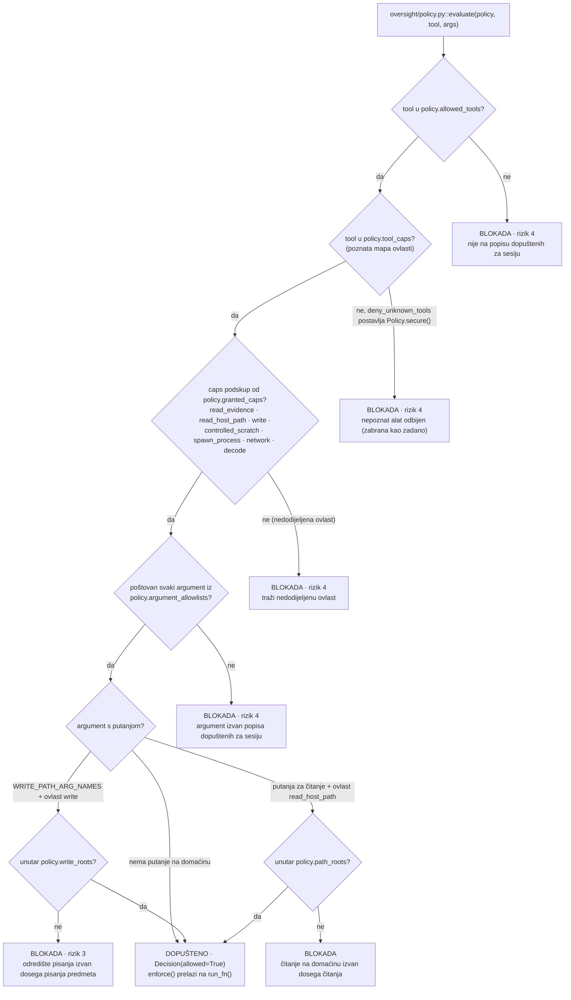
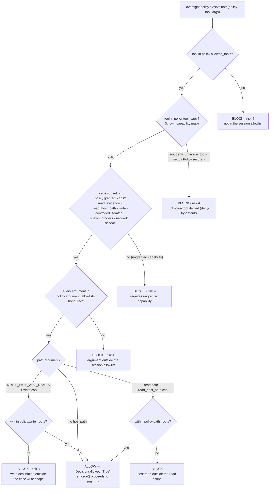

**Hrvatski** · [English](#english)

# Arhitektura: što sustav jest i što ga sprječava da izmisli odgovor

Ovaj je dokument namijenjen čitatelju koji odlučuje smije li se ovaj sustav
usmjeriti na dokaze. Navodi što sustav jest, što predaje uspostavljenom
forenzičkom softveru, što sam odlučuje, gdje su mu granice i, na prvom mjestu
jer je to prvo pitanje koje svatko postavi, što sprječava jezični model da
proizvede nalaz koji dokazi ne podupiru.

Imena modula i funkcija odnose se na stablo izvornog koda pod
`src/forensic_agent`; brojevi redaka, gdje su navedeni, služe kao pomoć pri
navigaciji kroz to stablo i mogu se pomaknuti, dok su imena stabilna. Pogled
održavatelja, odnosno izvršni put redom, modul po modul, nalazi se u
[Detaljima arhitekture](ARCHITECTURE_DETAIL.md). Popis forenzičke logike koju ovaj
projekt implementira sam, stavku po stavku, nalazi se u
[Arhitekturi](ARCHITECTURE.md#where-the-harness-adds-interpretation) i ovdje se
ne ponavlja.

## Što sustav jest

Pomoćnik za istragu vođen iz konzole. Operater otvara predmet, a to može biti
slika diska, snimka memorije, snimka mrežnog prometa ili direktorij koji sadrži
više njih, i postavlja pitanje običnim jezikom. Jezični model planira: bira koju
će od nepromjenjivog skupa registriranih Python funkcija pozvati sljedeću i s
kojim argumentima. Nikada ne otvara dokaze, nikada ne pokreće naredbu i nikada
ne vidi putanju na domaćinu koju nije dobio iz rezultata alata. Svaki poziv
izvodi izvršno okruženje, prvo ga procjenjuje prema sigurnosnim pravilima o
ovlastima, bilježi ga na lancu sažetaka samo za dopisivanje, standardizira u
tipizirani rezultat koji nosi vlastito podrijetlo i potvrdu, i tek ga onda
pokazuje modelu u ograničenoj projekciji. Kad izvođenje završi, odgovor se
objavljuje samo ako prođe kontrolne točke opisane niže; inače izvođenje ne
objavljuje ništa i navodi zašto.

## Što ga sprječava da nešto izmisli

Ne postoji jedan mehanizam. Postoji ih šest i vrijedi ih čitati redom jer svaki
zatvara ono što prethodni ne može.

| # | Mehanizam | Gdje se provodi | Što ne pokriva |
|---|---|---|---|
| 1 | **Model nema doseg.** Emitira ime funkcije i argumente; površina koju dobiva izvršno okruženje agenta zatvoren je popis `StructuredTool` objekata koje gradi `agent/model_surface.py::_prepare_model_surface()` i nepromijenjene predaje tvornici agenta. Nema ljuske ni `eval` poziva, a argument s putanjom na **domaćinu** provjerava se prema dosegu kad god deklarirane ovlasti funkcije uključuju čitanje ili pisanje na domaćinu. | `agent/model_surface.py` (gradnja, pa filtriranje na tražena imena); `agent/orchestration/preparation.py` | Alat koji je na popisu može se pozvati s bilo kojim argumentima koje njegova shema dopušta. Za to služi mehanizam 2. Funkciji koja drži samo `read_evidence` pravilo dosega namjerno ostavlja argument s putanjom neprovjerenim: ta je putanja relativna prema volumenu unutar slike, a ne lokacija na domaćinu. |
| 2 | **Svaki predloženi poziv procjenjuje se prije nego se izvede.** `oversight/enforcement.py::enforce()` procjenjuje sigurnosna pravila i do stvarnog poziva dolazi tek nakon četiri točke odbijanja koje su uvijek aktivne: provjera cjelovitosti dokaznog izvora, presuda sigurnosnih pravila, ponavljanje poziva koji je već deterministički propao te alatov vlastiti objavljeni ugovor o argumentima. Peta točka, odbijanje putanje koju model nije dobio iz ranijeg rezultata, postoji, ali je uvjetna i isključena je onako kako konzola postavlja sigurnosna pravila. Svaka aktivna točka upisuje zapis i vraća strukturirano odbijanje umjesto da se poziv izvede. | `oversight/enforcement.py`; na cijelu površinu primjenjuje ju `wrap_with_oversight()` u `agent/model_surface.py` | Kontrolna točka gradi se samo kad su sigurnosna pravila predana. Interaktivna konzola ih uvijek predaje, kroz `Policy.secure(...)` u `cli/controlled.py`, ali programski pozivatelj funkcije `run_investigation()` koji preda `policy=None` ne dobiva nikakvu kontrolnu točku. Jedna funkcija koju model može pozvati namjerno se sastavlja *nakon* kontrolne točke; vidi [Što nije pod nadzorom](#sto-nije-pod-nadzorom). |
| 3 | **Alat ne može klasificirati vlastiti izlaz.** Podrijetlo, epistemički razred, identitet izvora i potvrdu gradi standardizator izvršnog okruženja i nikada ih ne dostavlja alat: `core/result_contract.py::adapt_legacy_result()` prihvaća samo nestrukturirane sirove vrijednosti i odbija strukturiranu ili samoklasificiranu omotnicu, a svaki model ugovora je nepromjenjiv. Sam razred dolazi iz jedne tablice, razrješuje se po pozivu, i standardizator ga ne uzima niotkuda drugdje. | `agent/upstream_attestation.py::attest_call()` → `agent/evidence_classification.py::classify_tool_result()` → `agent/tool_contract.py` | Bilježi što neko očitanje *jest*; ne provjerava je li očitanje točno. |
| 4 | **Objavljeni odgovor smije imenovati samo identifikatore koje dokaz sadrži.** Prije objave izvještaj se pretražuje za vrijednosti koje se ne smiju pogađati, a to su imena datoteka u obliku izvršnih datoteka, IPv4 adrese te heksadekadski sažeci od 32, 40 ili 64 znaka. Svaka od njih mora se pojaviti u zadržanom rezultatu koji je prošao završnu provjeru prihvatljivosti. Jedan neutemeljen identifikator zadržava cijeli odgovor. | `agent/identifier_grounding.py::check_identifier_grounding()`, čiji skup za pretragu filtrira `core/result_admission.py::wire_passes_final_check()`; poziva se na oba puta objave u `agent/orchestration/finalization.py` | Namjerno je uzak. Provjerava *vrijednosti*, a ne rečenicu izgrađenu oko njih: izvještaj može navesti utemeljeno ime datoteke i iz njega izvući nepotkrijepljen zaključak, a ova će ga kontrolna točka propustiti. |
| 5 | **Rezultat smije potkrijepiti tvrdnju samo ako je vezan uz zapis ovog izvođenja koji je samo za dopisivanje.** Prihvatljivost nije "potvrda se podudara", jer potvrdu može ponovno izračunati svatko tko može urediti sadržaj. Prihvatljiv rezultat mora uz to biti vezan sažetkom sadržaja uz zapis na nadzornom lancu sažetaka, mora pripadati aktivnom predmetu i, ako je OBSERVED, razriješiti se u ovjereni izvor predmeta, odnosno, ako je DERIVED, imati razrješiv svaki tipizirani ulaz. REFERENCE i DIAGNOSTIC rezultati odbijaju se odmah. | `core/result_contract.py::result_is_admissible()`; lanac upisuje `oversight/audit.py::OversightLog` | Utvrđuje da je očitanje došlo iz ovog izvođenja nad ovim dokazom. Ne govori ništa o tome je li ga nadređeni parser ispravno pročitao. |
| 6 | **Izvođenje koje ne može utemeljiti svoj odgovor ne objavljuje ništa.** Devet determinističkih kontrolnih točaka oporavka može blokirati finalizaciju; zahtjev provjeritelju koji propadne, vrati prazno ili se ne može vezati na točno jedan odgovarajući redak evidencije ne daje prihvaćen izvještaj; nacrt nastao prije provjeritelja nikada se ne prihvaća kao zamjena. Svaki se ishod bilježi u zatvorenom rječniku, pa "nema odgovora" nikada nije jedan nediferenciran niz. | `agent/orchestration/finalization.py::_finalize_report()` i `_run_enabled_verification()`; `_PUBLICATION_BLOCKERS`; `UNPUBLISHED_ANSWER_CAUSES` | Zadržavanje odgovora je trošak, a ne samo sigurnosno svojstvo: ispravan nalaz može biti odbačen zato što je susjedna rečenica pretjerala u tvrdnji o odsutnosti, i upravo zato kontrolna točka za odsutnost dopisuje navedenu granicu umjesto da uništi izvještaj. |

### Što je zapravo objavljena rečenica

Ovo je važnije od svega navedenog, pa se navodi izravno.

Izvršno okruženje može objaviti odgovor na dva načina.

* **Sastavljanje u izvršnom okruženju.** Model vraća dokument sastavljen od
  segmenata, dakle vlastite rečenice uz neprozirne reference na vrijednosti koje
  želi navesti, a izvršno okruženje svaku vrijednost potraži u isporuci koju
  model imenuje i umetne pohranjeni tekst. Nakon tog koraka ne izvodi se nijedan
  model. Model i dalje može citirati krivo polje, ali ne može upisati vrijednost.
  `agent/structured_answer.py::assemble_structured_answer()`, objavljuje
  `agent/orchestration/finalization.py::_publish_assembled_answer()`. Autorstvo
  se bilježi kao `runtime_assembled`.
* **Provjerena proza modela.** Drugi prolaz modela dobiva pitanje, ograničeni
  paket dokaza i nacrt, te vraća izvještaj. Njegov je tekst objavljeni odgovor.
  Autorstvo se bilježi kao `model_written`.

**Interaktivna konzola koristi drugi način.**
`deliver_model_result_envelope` ima zadanu vrijednost `False`
(`agent/runtime.py::run_investigation`), a konzola predaje
`_console_delivers_model_result_envelope()`, koja vraća `False` osim ako je
`DFA_DELIVER_MODEL_RESULT_ENVELOPE` postavljena na uključenu vrijednost
(`cli/controlled.py`). Završna provjera konzole uključena je po zadanom
(`cli/controlled.py::_console_runs_the_final_check()`), pa
`_finalize_report()` ide granom `_run_enabled_verification()`. Vrijednosti u
odgovoru iz konzole stoga su riječi koje je napisao model, a mehanizam 4
provjerava ih prema dokazima. To nisu vrijednosti koje je umetnulo izvršno
okruženje.

Konzola operateru govori što se od toga dogodilo, u retku označenom
`answer source`, koji se čita iz vlastitog zabilježenog ishoda izvođenja kroz
`cli/presentation.py::ACCEPTED_ANSWER_SOURCES`. Pet prihvaćenih formulacija su
`verified model report`, `verified model report, coverage bound stated`,
`model draft, verification incomplete`, `unverified model draft` i
`runtime-assembled answer`; svaka trojka koje nema u toj tablici prikazuje se
kao `no accepted answer`.

Treća od njih ishod je zaštitne mreže "zadrži ili označi": provjeritelj se
izveo, ali ograničeni paket nikada nije nosio nalaz na kojem počiva neka
vrijednost iz nacrta, pa se ta vrijednost nije mogla prosuditi, a nacrt se
objavljuje uz oznaku koja govori koja je to vrijednost.

**Prije svega toga konzola pitanje razvrstava po dosegu.** Jedan mali zahtjev
ISTOM konfiguriranom modelu pita tiče li se unos učitanog slučaja, a ocjena
OFFTOPIC odbija ga prije nego što uopće postoje direktorij izvođenja i proračun
(`cli/scope_check.py::question_in_scope()`). Razvrstavanje je uključeno po
zadanom, a `DFA_SCOPE_TRIAGE=0` vadi ga u cijelosti
(`core/environ.py::scope_triage_enabled()`): nijedan klijent se ne gradi,
nijedan zahtjev ne šalje, i svako pitanje stiže do istrage. Ta postavka postoji
zbog usporedbe modela. Razvrstavanje troši jedan zahtjev modela koji se mjeri,
pa se slabiji model koji pogrešno odbije legitimno potpitanje ocjenjuje po
svojem razvrstavanju umjesto po svojoj istrazi — izmjereno na
`openai/gpt-oss-120b` i `openai/gpt-oss-20b`, koji su odbijali legitimna
potpitanja na hrvatskom. Koju je od dviju postavki izvođenje koristilo bilježi
se u polju `scope_triage` njegova zapisa `case_open`, pa se mjerenje bez te
tračnice ne može čitati kao mjerenje s njom.

### Što nije pod nadzorom

Jedna funkcija koju model može pozvati ne prolazi kroz nadzornu kontrolnu
točku: `result_page`, funkcija za navigaciju kroz pohranjene rezultate.
Dodaje se na površinu nakon što se `wrap_with_oversight()` izvršio i nema je u
`oversight/policy.py::DEFAULT_TOOL_CAPS`, dakle ne drži nikakvu ovlast. To je
namjerno i brani se na istoj osnovi na kojoj stoji i sama kontrolna točka: ne
izvodi ništa, ne otvara ništa i ne promatra ništa novo. Poslužuje zapise iz
rezultata koje je izvođenje već zadržalo, unovčujući neprozirni kursor koji je
izdalo izvršno okruženje. Proračun izvođenja mjeri ju zasebno
(`agent/execution_budget.py::reserve_navigation()`), pa ne može postati
neograničena petlja.

Dva daljnja iskrena ograničenja kontrolne točke onako kako je konzola postavlja:

* **Signali ubacivanja se bilježe, ne blokiraju.** `enforce()` pokreće
  `detect_injection` nad izlazom alata i dopisuje razlog u zapis; rezultat ne
  zadržava. Obrana od uputa ugrađenih u dokaze strukturna je, kroz reflektorsko
  isticanje i granicu podrijetla, a ne kroz detekciju.
* **Utemeljivanje putanja je isključeno.** Kontrolna točka može odbiti argument
  s putanjom koju model nije dobio iz prethodnog rezultata, ali samo kad je
  `policy.ground_paths` postavljen, a `Policy.secure()` ga ne postavlja.
  Neutemeljene putanje i dalje se bilježe kao razlozi u zapisu.

## Granice

```mermaid
flowchart LR
    OP([Istražitelj])

    subgraph CONSOLE["Konzola (samo prikaz)"]
        SESS["cli/session.py<br/>InteractiveSession"]
        CTRL["cli/controlled.py<br/>ControlledInvestigationSession"]
    end

    subgraph RUNTIME["Izvršno okruženje (ne odlučuje ništa o dokazima)"]
        ORCH["agent/orchestration/*<br/>faze, proračuni, kontrolne točke"]
        SURF["agent/model_surface.py<br/>zatvorena površina alata"]
    end

    MODEL["Jezični model<br/>(udaljena ili lokalna krajnja točka)"]

    subgraph GATE["Nadzor (jedini ulaz)"]
        ENF["oversight/enforcement.py::enforce()<br/>pravila · argumenti · ponavljanja · cjelovitost"]
        LOG["oversight/audit.py::OversightLog<br/>lanac sažetaka samo za dopisivanje"]
    end

    subgraph TOOLS["Sloj forenzičkih funkcija"]
        WRAP["tools/*.py omotači"]
        BACK["Sleuth Kit · libewf · regipy · libregf<br/>Volatility · tshark · libmagic · libpsl"]
    end

    EV[("Dokazi<br/>samo za čitanje")]
    SCR[("Kontrolirani radni prostor<br/>jedini doseg pisanja")]

    OP -->|pitanje| SESS --> CTRL --> ORCH
    ORCH --> SURF
    SURF -->|"sheme alata + sistemski prompt"| MODEL
    MODEL -->|"predloženi poziv"| ENF
    ENF -->|"dopušteno"| WRAP --> BACK --> EV
    WRAP -.->|"tipizirane privremene kopije"| SCR
    ENF --> LOG
    WRAP -->|"sirovi izlaz"| ORCH
    ORCH -->|"ograničena projekcija"| MODEL
    ORCH -->|"objavljeni odgovor + zapisi"| SESS --> OP

    classDef boundary stroke-dasharray: 5 5
    class GATE,TOOLS boundary
```

Poanta dijagrama su strelice kojih nema. Model nema brid prema dokazima, prema
radnom direktoriju ni prema zapisniku. Njegov je jedini izlazni brid predloženi
poziv, a taj brid završava na kontrolnoj točki.

### Rječnik ovlasti

Ovlaštenje funkcije je deklarirano, a ne izvedeno. `oversight/policy.py`
definira sedam ovlasti; svaka registrirana funkcija preslikana je na skup koji
koristi u `DEFAULT_TOOL_CAPS`, a `evaluate()` odbija svaki poziv čija funkcija
traži ovlast koju sigurnosna pravila sesije nisu dodijelila.

| Ovlast | Što ovlašćuje | Dodjeljuje li ju `Policy.secure()` na konzoli |
|---|---|---|
| `read_evidence` | Čitanje unutar otvorene slike ili predmeta, relativno prema volumenu | da |
| `read_host_path` | Čitanje proizvoljne putanje na domaćinu, uz provjeru dosega prema `path_roots` | da |
| `write` | Pisanje na disk domaćina (ekstrakcija, izrezivanje, privremeni izlaz) | da, ali odredišta se razrješavaju isključivo iz `write_roots` |
| `controlled_scratch` | Ograničena, samo alokatoru dostupna prolazna kopija pod ovjerenim korijenom radnog prostora | da, i to samo kad izvođenje fiksira ovjeru radnog prostora |
| `spawn_process` | Pokretanje provjerene vanjske forenzičke binarne datoteke (tshark, Volatility, 7z, tesseract) | da |
| `network` | Mrežni poziv iz same unutrašnjosti alata | **ne** |
| `decode` | Čista transformacija u memoriji bez ulaza i izlaza | da |

Konzola izvršive funkcije imenuje izrijekom u `allowed_tools`, a
`deny_unknown_tools` je uključen, pa se funkcija koje nema u mapi ovlasti odbija
umjesto da se smatra bezopasnom.

### Doseg čitanja i doseg pisanja dvije su različite zbirke

Argument odredišta poput `save_path` ne razrješava se prema istom popisu
korijena kao putanja za čitanje. Ta se dva dosega namjerno drže odvojenima,
kako izlazna putanja koju je odabrao model, a koja se nalazi unutar direktorija
s dokazima, ne bi postala dopušteno pisanje.

* `oversight/policy.py::WRITE_PATH_ARG_NAMES` (`save_path`, `out_path`,
  `output_path`) razrješava se **isključivo** iz `policy.write_roots`.
  Argumenti za čitanje razrješavaju se iz `policy.path_roots`.
* `write_roots` je po zadanom prazan. Neprazan se odbija već pri konstrukciji
  osim ako leži unutar ovjerenog korijena kontroliranog radnog prostora ovog
  izvođenja: `Policy.__post_init__` poziva
  `_assert_write_scope_is_attested_scratch()`, koja **ponovno ovjerava imenovani
  direktorij** pozivom `attest_controlled_scratch_root()` i uspoređuje dobiveni
  sažetak s onim koji je ovo izvođenje fiksiralo. Predavanje direktorija s
  dokazima kao radnog direktorija stoga propada, jer se identitet ne podudara.
* Ovjera nije niz znakova s putanjom.
  `core/controlled_scratch.py::attest_controlled_scratch_root()` prolazi svaku
  komponentu putanje i odbija simboličke poveznice i reparse točke, a njezin
  sažetak pokriva obvezu na stvarnu putanju, sidro volumena te broj uređaja i
  inode direktorija. `assert_controlled_scratch_root_current()` ponovno izvodi
  cijeli zapis pri svakoj alokaciji i pri zatvaranju.
* `Policy.secure()` radne direktorije stavlja u *obje* zbirke, a direktorije s
  dokazima samo u zbirku za čitanje. Doseg pisanja stoga je strogi podskup
  dosega čitanja, a dokazi se nalaze isključivo u dosegu čitanja.

### Odluka kroz koju prolazi predloženi poziv

`oversight/policy.py::evaluate()` jedina je funkcija koja odlučuje smije li se
predloženi poziv izvesti. Procjenjuje svaku provjeru navedenu niže, prikuplja
razlog za svaku koja padne i vraća `Decision(allowed=False)` ako je pala bilo
koja. Zatvara se u slučaju kvara i nikada ne prekida rano prema dopuštenju.
Redoslijed je popis dopuštenih, zatim zadano odbijanje nepoznatog koje postavlja
`Policy.secure()`, zatim skup ovlasti, zatim eventualni popis dopuštenih
argumenata za taj poziv, pa doseg putanja, pri čemu se odredište za `write`
razrješava isključivo iz `policy.write_roots`, a čitanje na domaćinu iz
`policy.path_roots`. `enforce()` dolazi do stvarnog `run_fn()` samo kad ovo
vrati dopuštenje.

### Dokazi se otvaraju samo za čitanje

Dvije odvojene činjenice, jer ih se često miješa.

1. **U kontejnerskoj instalaciji to provodi jezgra.** Direktorij s dokazima
   montiran je samo za čitanje, pa pisanje koje je usmjerio model ne može do
   njega doprijeti bez obzira na bilo kakav dogovor unutar procesa. Montiranje
   samo za čitanje ono je što jamstvo čini strukturnim, a ne dogovornim.
2. **Unutar procesa, samo za čitanje je dogovor s jednom provedenom iznimkom.**
   Put ovjere i sažimanja dokaza otvara izrijekom s `os.O_RDONLY` zastavicama i
   odbija izvor kojemu se identitet promijenio između pregleda i otvaranja
   (`core/evidence_source.py`). Svugdje drugdje dokazi se otvaraju Pythonovim
   načinom `"rb"`, koji je po semantici samo za čitanje, ali nije kontrola.
   **Pri izvođenju izravno na analitičarevom računalu, ono što drži pisanje
   usmjereno od modela podalje od dokaza jesu sigurnosna pravila na kontrolnoj
   točki, a ne sloj datoteka.**

## Što delegira, a što odlučuje

Čitanje dokaza je delegirano. Struktura datotečnog sustava i metapodaci dolaze
iz The Sleuth Kita kroz dfVFS; kontejneri slika iz libewf-a; vrijednosti registra
iz regipyja i libregf-a; memorija iz Volatilityja 3; snimke mrežnog prometa iz
tsharka; identifikacija tipa sadržaja iz libmagica; granica javnog sufiksa iz
libpsl-a. Svaki standardizirani rezultat imenuje komponentu i verziju koja ga je
proizvela, a OBSERVED rezultat koji ne može imenovati točno jednog stvarnog
proizvođača objavljuje se kao DIAGNOSTIC, dakle zabilježen i citabilan, ali
nikada kao dokazna osnova.

Ovaj projekt doista implementira i nešto vlastite forenzičke logike. Popis
stavku po stavku, dakle što svaki dio odlučuje i odlučuje li *što rezultat kaže*
(provjerljivo ponovnim izvođenjem) ili *dokle poziv doseže* (što upravlja
negativnim nalazima), nalazi se u
[Architecture § Where the harness adds interpretation](ARCHITECTURE.md#where-the-harness-adds-interpretation).

Što izvršno okruženje uvijek odlučuje samo:

* koje funkcije postoje i koje su vidljive za učitane tipove dokaza;
* smije li se predloženi poziv izvesti;
* epistemički razred, podrijetlo, vezanje na izvor i potvrdu svakog rezultata;
* koliko se rezultata pokazuje modelu i pod kojim referentnim imenom;
* smije li se odgovor uopće objaviti.

## Što ne radi

* Ne odlučuje o krivnji, namjeri ni pripisivanju i ne zamjenjuje vještaka.
  Stručni zaključak ostaje na istražitelju.
* Ne dokazuje autentičnost. Potvrda rezultata sažetak je cjelovitosti, a ne
  potpis: svatko tko može urediti sadržaj može ju ponovno izračunati.
  Cjelovitost dolazi iz vezanja sažetka sadržaja na nadzorni lanac koji je samo
  za dopisivanje, i zato se rezultat bez vezanja na lanac odbija.
* Ne provjerava ispravnost svojih pozadinskih alata. Utvrđuje da je očitanje
  došlo iz ovog izvođenja nad ovim dokazom, a ne da ga je nadređeni parser
  ispravno pročitao.
* Nije laboratorijska kontrola. Kontrolirani radni prostor štiti izvor i
  ograničava ponašanje aplikacije; nije zamjena za kontrolu pristupa operacijskog
  sustava, sigurno brisanje ni fizičku izolaciju.
* Ne jamči da je objavljena rečenica istinita. Mehanizam 4 jamči da su
  identifikatori u njoj bili opaženi. Tvrdnja izgrađena oko njih pripada modelu,
  a izvođenje to i bilježi
  (`published_text_authorship: model_written`).
* Nije po konstrukciji siguran za rad bez mreže. Mrežna ovlast isključena je u
  `Policy.secure()`, ali do same krajnje točke modela dolazi izvršno okruženje, a
  ne alat, pa je ona izvan sigurnosnih pravila o ovlastima.

## Gdje se te tvrdnje provjeravaju

Svaka tvrdnja na ovoj stranici imenuje modul i funkciju u stablu izvornog koda
pod `src/forensic_agent`, pa se može provjeriti čitanjem tog koda. Skup ovlasti,
blokatori objave, uzroci neobjavljenog odgovora, epistemički razredi, moduli faza
orkestracije, smjer ovisnosti među slojevima, zadani put odgovora, redoslijed
unutar `enforce()` i ovjera dosega pisanja svi se nalaze ondje. Tvrdnja koja se
nije mogla vezati uz određeni modul i funkciju oslabljena je dok se nije mogla.

---

[Hrvatski](#hrvatski) · **English**

# Architecture: what the system is, and what stops it inventing an answer

This document is for a reader deciding whether this system may be pointed at
evidence. It states what the system is, what it hands to established forensic
software, what it decides itself, where its boundaries are, and — first, because
it is the first question anyone asks — what prevents a language model from
producing a finding the evidence does not support.

Module and function names refer to the source tree under `src/forensic_agent`;
line numbers, where given, are navigation aids into that tree and may drift, while
the names are stable. The maintainer's view — the execution path in order, module
by module — is [Architecture detail](ARCHITECTURE_DETAIL.md). The per-item list of
forensic logic this project implements in-house is in
[Architecture](ARCHITECTURE.md#where-the-harness-adds-interpretation) and is not
repeated here.

## What it is

A console-driven investigation assistant. An operator opens a case — a disk
image, a memory capture, a network capture, or a directory holding
several of those — and asks a question in ordinary language. A language model
plans: it chooses which of a fixed set of registered Python functions to call
next, and with what arguments. It never opens evidence, never runs a command,
and never sees a host path it did not receive from a tool result. Each call is
performed by the runtime, evaluated against a capability policy first, recorded
on an append-only hash chain, standardized into a typed result carrying its own
provenance and receipt, and only then shown to the model in a bounded projection.
When the run ends, the answer is published only if it passes the gates below;
otherwise the run publishes nothing and says why.

## What stops it making something up

There is no single mechanism. There are six, and they are worth reading in order
because each one closes something the one before it cannot.

| # | The mechanism | Where it is enforced | What it does not cover |
|---|---|---|---|
| 1 | **The model has no reach.** It emits a function name and arguments; the surface the agent runtime is given is a closed list of `StructuredTool` objects built by `agent/model_surface.py::_prepare_model_surface()` and handed to the agent factory unchanged. There is no shell and no eval, and a **host** path argument is scope-checked whenever the function's declared capabilities include host read or host write access. | `agent/model_surface.py` (build, then filter to the requested names); `agent/orchestration/preparation.py` | A tool that is on the list can be called with any arguments its schema admits. That is what mechanism 2 is for. A function holding only `read_evidence` has its path argument left unchecked by the scope rule, deliberately: that path is volume-relative inside the image, not a host location. |
| 2 | **Every proposed call is judged before it runs.** `oversight/enforcement.py::enforce()` evaluates the policy and only reaches the real invocation after four refusal points that are always active: an evidence-source integrity checkpoint, the policy verdict, a repeat of a call that already failed deterministically, and the tool's own published argument contract. A fifth, refusal of a path the model did not obtain from an earlier result, is present but conditional and is off as the console configures the policy. Each active point records an entry and returns a structured refusal instead of executing. | `oversight/enforcement.py`; applied to the whole surface by `wrap_with_oversight()` at `agent/model_surface.py` | The gate is constructed only when a policy is supplied. The interactive console always supplies one — `Policy.secure(...)` at `cli/controlled.py` — but a programmatic caller of `run_investigation()` that passes `policy=None` gets no gate at all. One model-callable function is deliberately assembled *after* the gate; see [What is not gated](#what-is-not-gated). |
| 3 | **A tool cannot classify its own output.** Provenance, epistemic class, source identity and receipt are built by the runtime standardizer, never supplied by the tool: `core/result_contract.py::adapt_legacy_result()` accepts only unstructured raw values and rejects a structured or self-classified envelope, and every contract model is immutable. The class itself comes from one table, resolved per call, and the standardizer takes it from nowhere else. | `agent/upstream_attestation.py::attest_call()` → `agent/evidence_classification.py::classify_tool_result()` → `agent/tool_contract.py` | It records what a reading *is*; it does not check whether the reading is correct. |
| 4 | **A published answer may only name identifiers the evidence contains.** Before publication the report is scanned for values that must not be guessed — executable-style filenames, IPv4 addresses, and 32/40/64-hex digests — and each must occur in a retained result that passed the final admissibility check. One ungrounded identifier withholds the whole answer. | `agent/identifier_grounding.py::check_identifier_grounding()`, whose haystack is filtered by `core/result_admission.py::wire_passes_final_check()`; called on both publication paths in `agent/orchestration/finalization.py` | It is deliberately narrow. It checks the *values*, not the sentence built around them: a report may state a grounded filename and draw an unsupported conclusion from it, and this gate will pass it. |
| 5 | **A result may only back a claim if it is bound to the run's own append-only record.** Admissibility is not "the receipt matches" — a receipt can be recomputed by anyone who can edit the payload. An admissible result must additionally be bound by payload digest to an entry on the oversight hash chain, belong to the active case, and — if OBSERVED — resolve to an attested case source, or — if DERIVED — have every typed input resolve. REFERENCE and DIAGNOSTIC results are refused outright. | `core/result_contract.py::result_is_admissible()`; chain written by `oversight/audit.py::OversightLog` | It establishes that a reading came from this run over this evidence. It says nothing about whether the upstream parser read it correctly. |
| 6 | **A run that cannot establish its answer publishes nothing.** Nine deterministic recovery gates can block finalization; a verifier request that fails, returns empty, or cannot be bound to exactly one matching ledger row yields no accepted report; the pre-verifier draft is never accepted as a fallback. Every outcome is recorded in a closed vocabulary, so "no answer" is never one undifferentiated string. | `agent/orchestration/finalization.py::_finalize_report()` and `_run_enabled_verification()`; `_PUBLICATION_BLOCKERS`; `UNPUBLISHED_ANSWER_CAUSES` | Withholding an answer is a cost, not only a safety property: a correct finding can be discarded because a neighbouring sentence overstated an absence, which is why the absence gate below appends a stated bound rather than destroying the report. |

### What the published sentence actually is

This matters more than any of the above, so it is stated plainly.

The runtime can publish an answer in two ways.

* **Runtime assembly.** The model returns a segment document — its own sentences
  plus opaque references to values it wants stated — and the runtime looks each
  value up in the delivery it names and inserts the stored text. No model runs
  after that step. The model can still cite the wrong field, but it cannot type
  a value. `agent/structured_answer.py::assemble_structured_answer()`, published
  by `agent/orchestration/finalization.py::_publish_assembled_answer()`.
  Authorship recorded as `runtime_assembled`.
* **Model prose, verified.** A second model pass is given the question, a bounded
  evidence bundle, and the draft, and returns a report. Its text is the published
  answer. Authorship recorded as `model_written`.

**The interactive console uses the second.** `deliver_model_result_envelope`
defaults to `False` (`agent/runtime.py::run_investigation`) and the console
passes `_console_delivers_model_result_envelope()`, which returns `False` unless
`DFA_DELIVER_MODEL_RESULT_ENVELOPE` is set to an on value
(`cli/controlled.py`). The console's final check is on by default
(`cli/controlled.py::_console_runs_the_final_check()`), so
`_finalize_report()` takes the `_run_enabled_verification()` branch. The values
in a console answer are therefore words a model wrote, checked against the
evidence by mechanism 4 — not values the runtime inserted.

The console tells the operator which of these happened, in the row labelled
`answer source`, read from the run's own recorded outcome triple through
`cli/presentation.py::ACCEPTED_ANSWER_SOURCES`. The five accepted phrasings are
`verified model report`, `verified model report, coverage bound stated`,
`model draft, verification incomplete`, `unverified model draft`, and
`runtime-assembled answer`; every triple absent from that table displays as
`no accepted answer`.

The third of those is the keep-or-mark backstop's outcome: the verifier ran, but
the bounded bundle never carried the finding some draft value rests on, so that
value could not be judged and the draft is published with a marker saying which.

**Before any of that, the console triages the question for scope.** One small
request to the SAME configured model asks whether the input concerns the loaded
case, and an OFFTOPIC verdict refuses it before a run directory or a budget
exists (`cli/scope_check.py::question_in_scope()`). It is on by default and
`DFA_SCOPE_TRIAGE=0` takes it out entirely
(`core/environ.py::scope_triage_enabled()`): no client is constructed, no
request is made, and every question reaches the investigation. That setting
exists for model comparison. The triage spends a request of the model under
test, so a weaker model that wrongly refuses a legitimate follow-up is scored on
its triage rather than on its investigation — measured with
`openai/gpt-oss-120b` and `openai/gpt-oss-20b`, which refused legitimate
Croatian follow-up questions. Which of the two configurations a run used is
recorded in the `scope_triage` field of its `case_open` entry, so a measurement
taken without the rail cannot be read as one taken with it.

### What is not gated

One model-callable function does not pass through the oversight gate:
`result_page`, the stored-result navigation function. It is appended to the
surface after `wrap_with_oversight()` has run, and it is absent from
`oversight/policy.py::DEFAULT_TOOL_CAPS` — it holds no capability at all. This is
deliberate and is defensible on the same ground the gate stands on: it executes
nothing, opens nothing, and observes nothing new. It serves records from results
the run has already retained, redeeming an opaque cursor the runtime issued. It is
metered separately by the execution budget
(`agent/execution_budget.py::reserve_navigation()`), so it cannot become an
unbounded loop.

Two further honest limits on the gate as the console configures it:

* **Injection signals are recorded, not blocked.** `enforce()` runs
  `detect_injection` over the tool's output and appends a reason to the entry; it
  does not withhold the result. The defence against instructions embedded in
  evidence is structural — spotlighting and the provenance boundary — not
  detection.
* **Path grounding is off.** The gate can refuse a path argument the model did
  not obtain from a previous result, but only when `policy.ground_paths` is set,
  and `Policy.secure()` does not set it. The ungrounded paths are still recorded
  as reasons on the entry.

## The boundaries

```mermaid
flowchart LR
    OP([Investigator])

    subgraph CONSOLE["Console — presentation only"]
        SESS["cli/session.py<br/>InteractiveSession"]
        CTRL["cli/controlled.py<br/>ControlledInvestigationSession"]
    end

    subgraph RUNTIME["Runtime — decides nothing about evidence"]
        ORCH["agent/orchestration/*<br/>phases, budgets, gates"]
        SURF["agent/model_surface.py<br/>the closed tool surface"]
    end

    MODEL["Language model<br/>(remote or local endpoint)"]

    subgraph GATE["Oversight — the only way in"]
        ENF["oversight/enforcement.py::enforce()<br/>policy · arguments · repeats · integrity"]
        LOG["oversight/audit.py::OversightLog<br/>append-only hash chain"]
    end

    subgraph TOOLS["Forensic function layer"]
        WRAP["tools/*.py wrappers"]
        BACK["Sleuth Kit · libewf · regipy · libregf<br/>Volatility · tshark · libmagic · libpsl"]
    end

    EV[("Evidence<br/>read-only")]
    SCR[("Controlled scratch<br/>the only write scope")]

    OP -->|question| SESS --> CTRL --> ORCH
    ORCH --> SURF
    SURF -->|"tool schemas + system prompt"| MODEL
    MODEL -->|"proposed call"| ENF
    ENF -->|"permitted"| WRAP --> BACK --> EV
    WRAP -.->|"typed temporary copies"| SCR
    ENF --> LOG
    WRAP -->|"raw output"| ORCH
    ORCH -->|"bounded projection"| MODEL
    ORCH -->|"published answer + records"| SESS --> OP

    classDef boundary stroke-dasharray: 5 5
    class GATE,TOOLS boundary
```

The arrows that do not exist are the point of the diagram. The model has no edge
to the evidence, to the scratch directory, or to the audit log. Its only outgoing
edge is a proposed call, and that edge terminates at the gate.

### The capability vocabulary

A function's authority is declared, not inferred. `oversight/policy.py` defines
seven capabilities; each registered function is mapped to the set it exercises in
`DEFAULT_TOOL_CAPS`, and `evaluate()` refuses any call whose function requires a
capability the session policy did not grant.

| Capability | What it authorises | Granted by `Policy.secure()` on the console |
|---|---|---|
| `read_evidence` | Reading inside the opened image or case, volume-relative | yes |
| `read_host_path` | Reading an arbitrary host path, scope-checked against `path_roots` | yes |
| `write` | Writing to the host disk (extraction, carving, temporary output) | yes, but destinations are answered from `write_roots` alone |
| `controlled_scratch` | A bounded, allocator-only ephemeral copy under the attested scratch root | yes, and only when the run pins a scratch attestation |
| `spawn_process` | Spawning a verified external forensic binary (tshark, Volatility, 7z, tesseract) | yes |
| `network` | Making a network call from inside a tool | **no** |
| `decode` | A pure in-memory transform with no I/O | yes |

The console names the executable functions explicitly in `allowed_tools`, and
`deny_unknown_tools` is on, so a function absent from the capability map is
refused rather than treated as harmless.

### Read scope and write scope are two different collections

A destination argument such as `save_path` is not resolved against the same root
list as a read path. The two scopes are kept apart deliberately, so that a
model-chosen output path inside the evidence directory cannot become a permitted
write.

* `oversight/policy.py::WRITE_PATH_ARG_NAMES` (`save_path`, `out_path`,
  `output_path`) is answered from `policy.write_roots` **alone**. Read arguments
  are answered from `policy.path_roots`.
* `write_roots` is empty by default. A non-empty one is refused at construction
  unless it lies inside the run's attested controlled scratch root:
  `Policy.__post_init__` calls `_assert_write_scope_is_attested_scratch()`, which
  **re-attests the named directory** by calling `attest_controlled_scratch_root()`
  and comparing the resulting digest to the one this run pinned. Handing the
  evidence directory in as a work directory therefore fails: the identity does not
  match.
* The attestation is not a path string.
  `core/controlled_scratch.py::attest_controlled_scratch_root()` walks every path
  component rejecting symlinks and reparse points, and its digest covers the
  realpath commitment, the volume anchor, and the directory's device and inode
  numbers. `assert_controlled_scratch_root_current()` re-derives the whole record
  on every allocation and on close.
* `Policy.secure()` puts the work directories into *both* collections and the
  evidence directories into the read collection only. The write scope is
  therefore a strict subset of the read scope, and the evidence is in the read
  scope alone.

### The decision a proposed call passes through

`oversight/policy.py::evaluate()` is the one function that decides whether a
proposed call may run. It evaluates each check below, accumulates a reason for
every one that fails, and returns `Decision(allowed=False)` if any of them did —
it fails closed, and it never short-circuits into an allow. The order is the
allowlist, then the deny-unknown default `Policy.secure()` sets, then the
capability set, then any per-call argument allowlist, then the path scope — where
a `write` destination is answered from `policy.write_roots` alone and a host read
from `policy.path_roots`. `enforce()` only reaches the real `run_fn()` when this
returns an allow.

### Evidence is opened read-only

Two distinct facts, because they are commonly conflated.

1. **In a container deployment, the kernel enforces it.** The evidence directory
   is bound read-only, so a model-directed write cannot reach it regardless of any
   in-process convention. The read-only mount is what makes the guarantee
   structural rather than conventional.
2. **In process, read-only is a convention with one enforced exception.** The
   evidence attestation and hashing path opens with explicit `os.O_RDONLY` flags
   and refuses a source whose identity changed between inspection and opening
   (`core/evidence_source.py`). Everywhere else, evidence is opened with Python's
   `"rb"` mode, which is read-only by semantics but is not a control. **Running
   natively on an analyst's machine, the thing that keeps a model-directed write
   off the evidence is the policy gate, not the file layer.**

## What it delegates, and what it decides

The reading of evidence is delegated. Filesystem structure and metadata come from
The Sleuth Kit through dfVFS; image containers from libewf; registry values from
regipy and libregf; memory from Volatility 3; network captures from tshark;
payload type identification from libmagic; the public
suffix boundary from libpsl. Each standardized result names the component and the
version that produced it, and an OBSERVED result that cannot name exactly one
real producer is published as DIAGNOSTIC instead — recorded and quotable, never
an evidential basis.

This project does implement some forensic logic of its own. The per-item list —
what each piece decides, and whether it decides *what a result says* (checkable by
re-derivation) or *what a call reaches* (which governs negative findings) — is
[Architecture § Where the harness adds interpretation](ARCHITECTURE.md#where-the-harness-adds-interpretation).

What the runtime always decides itself:

* which functions exist and which are visible for the loaded evidence types;
* whether a proposed call may run;
* the epistemic class, provenance, source binding and receipt of every result;
* how much of a result the model is shown, and under what reference name;
* whether an answer may be published at all.

## What it does not do

* It does not decide guilt, intent, or attribution, and it does not replace the
  examiner. The investigator retains the professional conclusion.
* It does not prove authenticity. The result receipt is an integrity digest, not
  a signature: anyone who can edit a payload can recompute it. Integrity comes
  from binding the payload digest to the append-only oversight chain, which is
  why a result with no chain binding is refused.
* It does not validate its backends' correctness. It establishes that a reading
  came from this run over this evidence, not that the upstream parser read it
  correctly.
* It is not a laboratory control. The controlled scratch directory protects the
  source and bounds application behaviour; it is not a substitute for operating
  system access control, secure deletion, or physical isolation.
* It does not guarantee that a published sentence is true. Mechanism 4 guarantees
  that the identifiers in it were observed. The claim built around them is the
  model's, and the run records that it is
  (`published_text_authorship: model_written`).
* It does not run offline-safe by construction. Network capability is off in
  `Policy.secure()`, but the model endpoint itself is reached by the runtime, not
  by a tool, and is therefore outside the capability policy.

## Where these claims are checked

Every claim on this page names a module and a function in the source tree under
`src/forensic_agent`, so it can be checked by reading that code. The capability
set, the publication blockers, the unpublished-answer causes, the epistemic
classes, the orchestration phase modules, the layer dependency direction, the
default answer path, the ordering inside `enforce()`, and the write-scope
attestation are all located there. Where a claim could not be tied to a specific
module and function, it has been weakened until it could.
