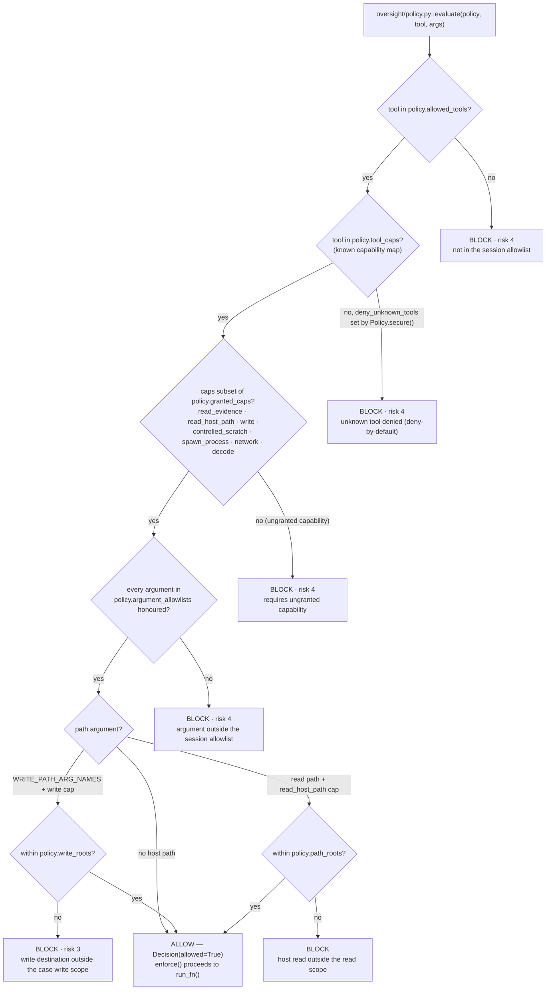

# Architecture: what the system is, and what stops it inventing an answer

This document is for a reader deciding whether this system may be pointed at
evidence. It states what the system is, what it hands to established forensic
software, what it decides itself, where its boundaries are, and — first, because
it is the first question anyone asks — what prevents a language model from
producing a finding the evidence does not support.

Module and function names refer to the source tree under `src/forensic_agent`;
line numbers, where given, are navigation aids into that tree and may drift, while
the names are stable. The maintainer's view — the execution path in order, module
by module — is [Architecture detail](ARCHITECTURE_DETAIL.md). The per-item list of
forensic logic this project implements in-house is in
[Architecture](ARCHITECTURE.md#where-the-harness-adds-interpretation) and is not
repeated here.

## What it is

A console-driven investigation assistant. An operator opens a case — a disk
image, a memory capture, a network capture, or a directory holding
several of those — and asks a question in ordinary language. A language model
plans: it chooses which of a fixed set of registered Python functions to call
next, and with what arguments. It never opens evidence, never runs a command,
and never sees a host path it did not receive from a tool result. Each call is
performed by the runtime, evaluated against a capability policy first, recorded
on an append-only hash chain, standardized into a typed result carrying its own
provenance and receipt, and only then shown to the model in a bounded projection.
When the run ends, the answer is published only if it passes the gates below;
otherwise the run publishes nothing and says why.

## What stops it making something up

There is no single mechanism. There are six, and they are worth reading in order
because each one closes something the one before it cannot.

| # | The mechanism | Where it is enforced | What it does not cover |
|---|---|---|---|
| 1 | **The model has no reach.** It emits a function name and arguments; the surface the agent runtime is given is a closed list of `StructuredTool` objects built by `agent/model_surface.py::_prepare_model_surface()` and handed to the agent factory unchanged. There is no shell and no eval, and a **host** path argument is scope-checked whenever the function's declared capabilities include host read or host write access. | `agent/model_surface.py` (build, then filter to the requested names); `agent/orchestration/preparation.py` | A tool that is on the list can be called with any arguments its schema admits. That is what mechanism 2 is for. A function holding only `read_evidence` has its path argument left unchecked by the scope rule, deliberately: that path is volume-relative inside the image, not a host location. |
| 2 | **Every proposed call is judged before it runs.** `oversight/enforcement.py::enforce()` evaluates the policy and only reaches the real invocation after four refusal points that are always active: an evidence-source integrity checkpoint, the policy verdict, a repeat of a call that already failed deterministically, and the tool's own published argument contract. A fifth, refusal of a path the model did not obtain from an earlier result, is present but conditional and is off as the console configures the policy. Each active point records an entry and returns a structured refusal instead of executing. | `oversight/enforcement.py`; applied to the whole surface by `wrap_with_oversight()` at `agent/model_surface.py` | The gate is constructed only when a policy is supplied. The interactive console always supplies one — `Policy.secure(...)` at `cli/controlled.py` — but a programmatic caller of `run_investigation()` that passes `policy=None` gets no gate at all. One model-callable function is deliberately assembled *after* the gate; see [What is not gated](#what-is-not-gated). |
| 3 | **A tool cannot classify its own output.** Provenance, epistemic class, source identity and receipt are built by the runtime standardizer, never supplied by the tool: `core/result_contract.py::adapt_legacy_result()` accepts only unstructured raw values and rejects a structured or self-classified envelope, and every contract model is immutable. The class itself comes from one table, resolved per call, and the standardizer takes it from nowhere else. | `agent/upstream_attestation.py::attest_call()` → `agent/evidence_classification.py::classify_tool_result()` → `agent/tool_contract.py` | It records what a reading *is*; it does not check whether the reading is correct. |
| 4 | **A published answer may only name identifiers the evidence contains.** Before publication the report is scanned for values that must not be guessed — executable-style filenames, IPv4 addresses, and 32/40/64-hex digests — and each must occur in a retained result that passed the final admissibility check. One ungrounded identifier withholds the whole answer. | `agent/identifier_grounding.py::check_identifier_grounding()`, whose haystack is filtered by `core/result_admission.py::wire_passes_final_check()`; called on both publication paths in `agent/orchestration/finalization.py` | It is deliberately narrow. It checks the *values*, not the sentence built around them: a report may state a grounded filename and draw an unsupported conclusion from it, and this gate will pass it. |
| 5 | **A result may only back a claim if it is bound to the run's own append-only record.** Admissibility is not "the receipt matches" — a receipt can be recomputed by anyone who can edit the payload. An admissible result must additionally be bound by payload digest to an entry on the oversight hash chain, belong to the active case, and — if OBSERVED — resolve to an attested case source, or — if DERIVED — have every typed input resolve. REFERENCE and DIAGNOSTIC results are refused outright. | `core/result_contract.py::result_is_admissible()`; chain written by `oversight/audit.py::OversightLog` | It establishes that a reading came from this run over this evidence. It says nothing about whether the upstream parser read it correctly. |
| 6 | **A run that cannot establish its answer publishes nothing.** Nine deterministic recovery gates can block finalization; a verifier request that fails, returns empty, or cannot be bound to exactly one matching ledger row yields no accepted report; the pre-verifier draft is never accepted as a fallback. Every outcome is recorded in a closed vocabulary, so "no answer" is never one undifferentiated string. | `agent/orchestration/finalization.py::_finalize_report()` and `_run_enabled_verification()`; `_PUBLICATION_BLOCKERS`; `UNPUBLISHED_ANSWER_CAUSES` | Withholding an answer is a cost, not only a safety property: a correct finding can be discarded because a neighbouring sentence overstated an absence, which is why the absence gate below appends a stated bound rather than destroying the report. |

### What the published sentence actually is

This matters more than any of the above, so it is stated plainly.

The runtime can publish an answer in two ways.

* **Runtime assembly.** The model returns a segment document — its own sentences
  plus opaque references to values it wants stated — and the runtime looks each
  value up in the delivery it names and inserts the stored text. No model runs
  after that step. The model can still cite the wrong field, but it cannot type
  a value. `agent/structured_answer.py::assemble_structured_answer()`, published
  by `agent/orchestration/finalization.py::_publish_assembled_answer()`.
  Authorship recorded as `runtime_assembled`.
* **Model prose, verified.** A second model pass is given the question, a bounded
  evidence bundle, and the draft, and returns a report. Its text is the published
  answer. Authorship recorded as `model_written`.

**The interactive console uses the second.** `deliver_model_result_envelope`
defaults to `False` (`agent/runtime.py::run_investigation`) and the console
passes `_console_delivers_model_result_envelope()`, which returns `False` unless
`DFA_DELIVER_MODEL_RESULT_ENVELOPE` is set to an on value
(`cli/controlled.py`). The console's final check is on by default
(`cli/controlled.py::_console_runs_the_final_check()`), so
`_finalize_report()` takes the `_run_enabled_verification()` branch. The values
in a console answer are therefore words a model wrote, checked against the
evidence by mechanism 4 — not values the runtime inserted.

The console tells the operator which of these happened, in the row labelled
`answer source`, read from the run's own recorded outcome triple through
`cli/presentation.py::ACCEPTED_ANSWER_SOURCES`. The five accepted phrasings are
`verified model report`, `verified model report, coverage bound stated`,
`model draft, verification incomplete`, `unverified model draft`, and
`runtime-assembled answer`; every triple absent from that table displays as
`no accepted answer`.

The third of those is the keep-or-mark backstop's outcome: the verifier ran, but
the bounded bundle never carried the finding some draft value rests on, so that
value could not be judged and the draft is published with a marker saying which.

**Before any of that, the console triages the question for scope.** One small
request to the SAME configured model asks whether the input concerns the loaded
case, and an OFFTOPIC verdict refuses it before a run directory or a budget
exists (`cli/scope_check.py::question_in_scope()`). It is on by default and
`DFA_SCOPE_TRIAGE=0` takes it out entirely
(`core/environ.py::scope_triage_enabled()`): no client is constructed, no
request is made, and every question reaches the investigation. That setting
exists for model comparison. The triage spends a request of the model under
test, so a weaker model that wrongly refuses a legitimate follow-up is scored on
its triage rather than on its investigation — measured with
`openai/gpt-oss-120b` and `openai/gpt-oss-20b`, which refused legitimate
Croatian follow-up questions. Which of the two configurations a run used is
recorded in the `scope_triage` field of its `case_open` entry, so a measurement
taken without the rail cannot be read as one taken with it.

### What is not gated

One model-callable function does not pass through the oversight gate:
`result_page`, the stored-result navigation function. It is appended to the
surface after `wrap_with_oversight()` has run, and it is absent from
`oversight/policy.py::DEFAULT_TOOL_CAPS` — it holds no capability at all. This is
deliberate and is defensible on the same ground the gate stands on: it executes
nothing, opens nothing, and observes nothing new. It serves records from results
the run has already retained, redeeming an opaque cursor the runtime issued. It is
metered separately by the execution budget
(`agent/execution_budget.py::reserve_navigation()`), so it cannot become an
unbounded loop.

Two further honest limits on the gate as the console configures it:

* **Injection signals are recorded, not blocked.** `enforce()` runs
  `detect_injection` over the tool's output and appends a reason to the entry; it
  does not withhold the result. The defence against instructions embedded in
  evidence is structural — spotlighting and the provenance boundary — not
  detection.
* **Path grounding is off.** The gate can refuse a path argument the model did
  not obtain from a previous result, but only when `policy.ground_paths` is set,
  and `Policy.secure()` does not set it. The ungrounded paths are still recorded
  as reasons on the entry.

## The boundaries

The arrows that do not exist are the point of the diagram. The model has no edge
to the evidence, to the scratch directory, or to the run record. Its only outgoing
edge is a proposed call, and that edge terminates at the gate.

### The capability vocabulary

A function's authority is declared, not inferred. `oversight/policy.py` defines
seven capabilities; each registered function is mapped to the set it exercises in
`DEFAULT_TOOL_CAPS`, and `evaluate()` refuses any call whose function requires a
capability the session policy did not grant.

| Capability | What it authorises | Granted by `Policy.secure()` on the console |
|---|---|---|
| `read_evidence` | Reading inside the opened image or case, volume-relative | yes |
| `read_host_path` | Reading an arbitrary host path, scope-checked against `path_roots` | yes |
| `write` | Writing to the host disk (extraction, carving, temporary output) | yes, but destinations are answered from `write_roots` alone |
| `controlled_scratch` | A bounded, allocator-only ephemeral copy under the attested scratch root | yes, and only when the run pins a scratch attestation |
| `spawn_process` | Spawning a verified external forensic binary (tshark, Volatility, 7z, tesseract) | yes |
| `network` | Making a network call from inside a tool | **no** |
| `decode` | A pure in-memory transform with no I/O | yes |

The console names the executable functions explicitly in `allowed_tools`, and
`deny_unknown_tools` is on, so a function absent from the capability map is
refused rather than treated as harmless.

### Read scope and write scope are two different collections

A destination argument such as `save_path` is not resolved against the same root
list as a read path. The two scopes are kept apart deliberately, so that a
model-chosen output path inside the evidence directory cannot become a permitted
write.

* `oversight/policy.py::WRITE_PATH_ARG_NAMES` (`save_path`, `out_path`,
  `output_path`) is answered from `policy.write_roots` **alone**. Read arguments
  are answered from `policy.path_roots`.
* `write_roots` is empty by default. A non-empty one is refused at construction
  unless it lies inside the run's attested controlled scratch root:
  `Policy.__post_init__` calls `_assert_write_scope_is_attested_scratch()`, which
  **re-attests the named directory** by calling `attest_controlled_scratch_root()`
  and comparing the resulting digest to the one this run pinned. Handing the
  evidence directory in as a work directory therefore fails: the identity does not
  match.
* The attestation is not a path string.
  `core/controlled_scratch.py::attest_controlled_scratch_root()` walks every path
  component rejecting symlinks and reparse points, and its digest covers the
  realpath commitment, the volume anchor, and the directory's device and inode
  numbers. `assert_controlled_scratch_root_current()` re-derives the whole record
  on every allocation and on close.
* `Policy.secure()` puts the work directories into *both* collections and the
  evidence directories into the read collection only. The write scope is
  therefore a strict subset of the read scope, and the evidence is in the read
  scope alone.

### The decision a proposed call passes through

`oversight/policy.py::evaluate()` is the one function that decides whether a
proposed call may run. It evaluates each check below, accumulates a reason for
every one that fails, and returns `Decision(allowed=False)` if any of them did —
it fails closed, and it never short-circuits into an allow. The order is the
allowlist, then the deny-unknown default `Policy.secure()` sets, then the
capability set, then any per-call argument allowlist, then the path scope — where
a `write` destination is answered from `policy.write_roots` alone and a host read
from `policy.path_roots`. `enforce()` only reaches the real `run_fn()` when this
returns an allow.

### Evidence is opened read-only

Two distinct facts, because they are commonly conflated.

1. **In a container deployment, the kernel enforces it.** The evidence directory
   is bound read-only, so a model-directed write cannot reach it regardless of any
   in-process convention. The read-only mount is what makes the guarantee
   structural rather than conventional.
2. **In process, read-only is a convention with one enforced exception.** The
   evidence attestation and hashing path opens with explicit `os.O_RDONLY` flags
   and refuses a source whose identity changed between inspection and opening
   (`core/evidence_source.py`). Everywhere else, evidence is opened with Python's
   `"rb"` mode, which is read-only by semantics but is not a control. **Running
   natively on an analyst's machine, the thing that keeps a model-directed write
   off the evidence is the policy gate, not the file layer.**

## What it delegates, and what it decides

The reading of evidence is delegated. Filesystem structure and metadata come from
The Sleuth Kit through dfVFS; image containers from libewf; registry values from
regipy and libregf; memory from Volatility 3; network captures from tshark;
payload type identification from libmagic; the public
suffix boundary from libpsl. Each standardized result names the component and the
version that produced it, and an OBSERVED result that cannot name exactly one
real producer is published as DIAGNOSTIC instead — recorded and quotable, never
an evidential basis.

This project does implement some forensic logic of its own. The per-item list —
what each piece decides, and whether it decides *what a result says* (checkable by
re-derivation) or *what a call reaches* (which governs negative findings) — is
[Architecture § Where the harness adds interpretation](ARCHITECTURE.md#where-the-harness-adds-interpretation).

What the runtime always decides itself:

* which functions exist and which are visible for the loaded evidence types;
* whether a proposed call may run;
* the epistemic class, provenance, source binding and receipt of every result;
* how much of a result the model is shown, and under what reference name;
* whether an answer may be published at all.

## What it does not do

* It does not decide guilt, intent, or attribution, and it does not replace the
  examiner. The investigator retains the professional conclusion.
* It does not prove authenticity. The result receipt is an integrity digest, not
  a signature: anyone who can edit a payload can recompute it. Integrity comes
  from binding the payload digest to the append-only oversight chain, which is
  why a result with no chain binding is refused.
* It does not validate its backends' correctness. It establishes that a reading
  came from this run over this evidence, not that the upstream parser read it
  correctly.
* It is not a laboratory control. The controlled scratch directory protects the
  source and bounds application behaviour; it is not a substitute for operating
  system access control, secure deletion, or physical isolation.
* It does not guarantee that a published sentence is true. Mechanism 4 guarantees
  that the identifiers in it were observed. The claim built around them is the
  model's, and the run records that it is
  (`published_text_authorship: model_written`).
* It does not run offline-safe by construction. Network capability is off in
  `Policy.secure()`, but the model endpoint itself is reached by the runtime, not
  by a tool, and is therefore outside the capability policy.

## Where these claims are checked

Every claim on this page names a module and a function in the source tree under
`src/forensic_agent`, so it can be checked by reading that code. The capability
set, the publication blockers, the unpublished-answer causes, the epistemic
classes, the orchestration phase modules, the layer dependency direction, the
default answer path, the ordering inside `enforce()`, and the write-scope
attestation are all located there. Where a claim could not be tied to a specific
module and function, it has been weakened until it could.
